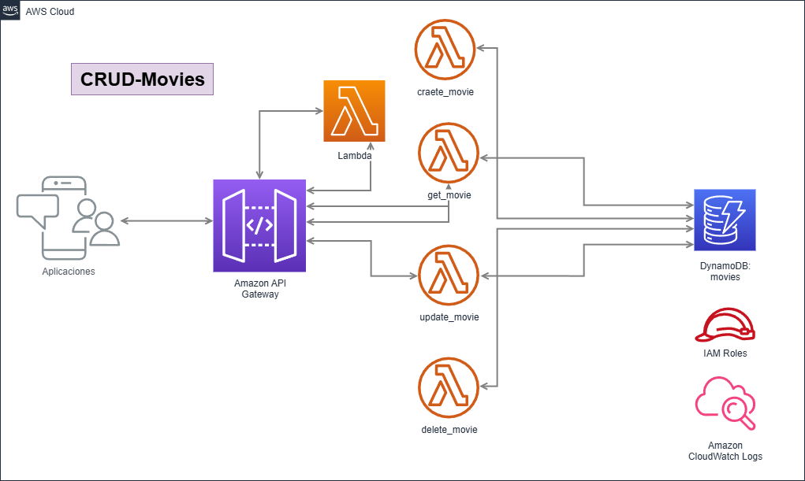

## CRUD Serverless Movies: ApiGateway - Lambda - DynamoDB

Sencillo Laboratorio CRUD Serverless que consta de APIRest para gestión de peliculas que interactuan con la base de datos NOSQL DynamoDB por medio de operaciones. El core de las APIs son funciones Lambda.
El objetivo es crear una arquitectura moderna que se pueda utilizar en cualquier Caso de Uso de ABM y aprender a utilizar terraform y SAM.

El deploy de los servicios se puede realizar de 3 maneras diferentes (se recomienda ejercitar todas).

## Estructura del Proyecto

```
CRUD_Lambda-Dynamo-Apigateway/
├── sam/
│   ├── samconfig.toml
│   └── template.yaml
├── src/
│   ├── lambda_function_create.py
│   ├── lambda_function_delete.py
│   ├── lambda_function_get.py
│   └── lambda_function_update.py
├── terraform/
│   ├── main.tf
│   ├── outputs.tf
│   └── variables.tf
├── tutorial-recursos/
│   ├── APIsMovies-AWS.postman_collection.json
│   ├── CRUD-Lambda-Dynamo-Apigateway.png
│   └── LabCRUD-Dynamo-ApiGateway-Lambda.pdf
└── README.md
```


### Pre.Requisitos

-Una AWS account con credenciales configuradas (aws configure)

-Si queremos deployar con Terraform --> tener instalado Terraform:
https://developer.hashicorp.com/terraform/install

-Si queremos deployar con SAM --> tener instalado SAM:
https://docs.aws.amazon.com/serverless-application-model/latest/developerguide/serverless-getting-started.html


## 🏗️ Arquitectura




## 🚀 Opciones de Deployment

El deploy o creación de la infraestructura se puede realizar de 3 maneras diferentes planteados en este repo. Luego del deployment verificar en la consola y hacer las correspondientes pruebas (ver pdf y colección postman):

a- Por medio de la consola de AWS de manera manual. Siguiendo el paso a paso del documento en tutorial-recursos/LabCRUD-Dynamo-ApiGateway-Lambda.pdf

b-Por medio de terraform siguiendo la sección Deployment Options --Opción 1: Terraform
(recomiendo ejecutar instrucción por instrucción)

c-Por medio de SAM (AWS Serverless Application Model), siguiendo la sección Deployment Options --Opción 2: SAM
(recomiendo ejecutar instrucción por instrucción)


### Opción 1: Terraform (posicionar en la carpeta terraform)
```bash
cd terraform
terraform init
terraform validate
terraform plan
terraform apply
```

Limpiar ambiente luego de nuestras pruebas
```bash
terraform destroy
```
Nota: Eliminar los log de monitoreo manualmente ingresarndo a la consola CloudWatch

### Opción 2: SAM (posicionar en la carpeta sam)
1. ** Validar el template **
sam validate

2. ** Build (prepara los paquetes Lambda) **
sam build

3. ** Deploy (primera vez - modo guiado) **
sam deploy --guided

4. ** Deploy (despliegues posteriores) **
sam deploy

5. ** Para eliminar todos los recursos **
sam delete

# Nota: SAM crea un stack 'aws-sam-cli-managed-default' para gestionar
Ingresar a la consola de CloudFormation y eliminar el stack 
6. ** Eliminar tu stack principal **
sam delete --stack-name crud-movies-llb --region us-east-1 --no-prompts

7. ** Eliminar el stack managed (opcional, no recomendado) **
aws cloudformation delete-stack --stack-name aws-sam-cli-managed-default --region us-east-1

8. ** Eliminar el bucket S3 manualmente por medio de la consola de aws o completar está instruccion con el nombre reemplazando las "xxxx" **
aws s3 rb s3://aws-sam-cli-managed-default-samclisourcebucket-xxxxx --force

Nota: Eliminar los log de monitoreo manualmente ingresarndo a la consola CloudWatch 👇

## 📊 Monitoreo

### CloudWatch Logs

Los logs se almacenan automáticamente en CloudWatch:

- **Lambda logs**: `/aws/lambda/xxxxx`


## Colección Postman para testing
Reemplazar url por la salida del deployment por el "API Gateway endpoint URL" 
tutorial-recursos/APIsMovies-AWS.postman_collection.json