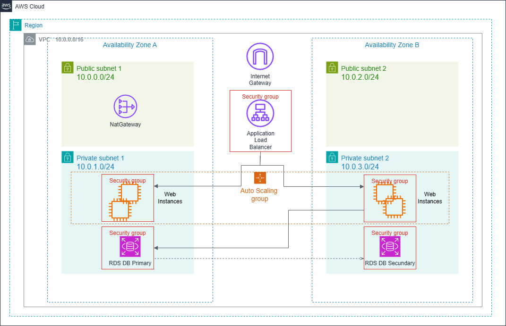

# AWS Reference Architecture - Multi-AZ Web Application

Esta es una arquitectura de referencia que implementa las mejores prácticas de AWS para aplicaciones web de alta disponibilidad, con una landing page interactiva que muestra el estado de la infraestructura en tiempo real.

**Nota**: Todas las instrucciones de apertura de permisos (chmod), si trabajamos en windows no son necesarias.

## 🏗️ Arquitectura



La aplicación está distribuida en dos zonas de disponibilidad (AZs) e implementa los siguientes componentes:

- **VPC**: Red virtual aislada con CIDR 10.0.0.0/16
- **Subnets Públicas**: Para ALB y NAT Gateway (10.0.0.0/24, 10.0.2.0/24)
- **Subnets Privadas**: Para instancias EC2 y RDS (10.0.1.0/24, 10.0.3.0/24)
- **Application Load Balancer**: Distribución de tráfico entre instancias
- **Auto Scaling Group**: Escalado automático de instancias EC2
- **RDS Multi-AZ**: Base de datos MySQL con réplica sincrónica
- **NAT Gateway**: Acceso a Internet desde subnets privadas
- **Security Groups**: Control de tráfico a nivel de instancia

📊 Configuración de Auto Scaling
MinSize: 2          # Mínimo 2 instancias
MaxSize: 6          # Máximo 6 instancias  
DesiredCapacity: 2  # Inicia con 2 instancias

📈 Políticas de Escalado propuesta
Scale Up: CPU > 70% por 10 min → +1 instancia
Scale Down: CPU < 25% por 10 min → -1 instancia

Cooldown: 5 minutos entre escalados


## 📋 Prerrequisitos

- Cuenta de AWS activa y AWS CLI
- Terraform >= 1.0 o CloudFormation
- Git
- Python 3.8+
- Docker Desktop

## 🚀 Estructura del Proyecto

```
HA_ALB-AS-EC2-RDS/
├── README.md                    # Este archivo
├── recursos/
│   ├── elb-as-rds.png          # Diagrama de arquitectura
│   ├── elb-as-rds.drawio       # Archivo fuente del diagrama (Draw.io)
│   └── cloudformation.png      # Diagrama de CloudFormation
├── terraform/                   # Implementación con Terraform
│   ├── main.tf                 # Configuración principal y AMI
│   ├── vpc.tf                  # VPC, subnets, routing y security groups
│   ├── alb.tf                  # Application Load Balancer y target group
│   ├── ec2.tf                  # Launch template, Auto Scaling y CloudWatch
│   ├── rds.tf                  # RDS MySQL y configuración
│   ├── variables.tf            # Variables de entrada
│   ├── outputs.tf              # Outputs de la infraestructura
│   ├── terraform.tfvars.example # Ejemplo de variables
│   ├── docker-construct-tf.sh  # Script para build y upload Docker a S3
│   ├── user_data.sh            # Script de inicialización para el template instancias EC2
│   └── README.md               # Instrucciones de deployment Terraform
├── cloudFormation/             # Implementación con CloudFormation
│   ├── master-docker.yaml      # Template principal (nested stacks)
│   ├── vpc.yaml                # VPC y networking
│   ├── compute-docker.yaml     # ALB, Auto Scaling, EC2
│   ├── database.yaml           # RDS MySQL
│   ├── deploy-docker.sh        # Script de deployment
│   ├── cleanup.sh              # Script de limpieza
│   └── README.md               # Instrucciones de deployment CloudFormation
└── application/                # Aplicación web Flask
    ├── app.py                  # Backend Flask con endpoints
    ├── requirements.txt        # Dependencias Python
    ├── Dockerfile             # Imagen Docker
    ├── .env.example           # Variables de entorno de ejemplo
    └── frontend/
        └── index.html         # Landing page interactiva
```

## 🔧 Componentes de la Aplicación

### Backend (Flask)

El backend está desarrollado en Python con Flask y proporciona los siguientes endpoints:

- `GET /` - Landing page principal
- `GET /api/db-status` - Estado y características de RDS
- `GET /api/health` - Health check de la aplicación
- `GET /api/test-query` - Query de prueba a la base de datos

### Frontend (HTML/CSS/JavaScript)

Landing page responsive que muestra:

- Descripción de la arquitectura
- Cards con información de cada servicio AWS
- Botón interactivo para verificar el estado de RDS
- Métricas en tiempo real de la base de datos

## 📦 Instalación Local

### 1. Clonar el repositorio

```bash
git clone https://github.com/reinalau/labs-aws-llb.git
cd HA_ALB-AS-EC2-RDS/application
```

### 2. Instalar dependencias

```bash
pip3 install -r requirements.txt
```

### 3. Configurar variables de entorno

```bash
cp .env.example .env
# Editar .env con las credenciales de tu RDS
nano .env
```

### 5. Ejecutar la aplicación

```bash
python3 app.py
```

La aplicación estará disponible en `http://localhost:5000`

## 🐳 Deployment con Docker de forma Local

### Construir la imagen

```bash
docker build -t aws-reference-app .
```

### Ejecutar el contenedor

```bash
docker run -d \
  -p 5000:5000 \
  -e DB_HOST=your-rds-endpoint.rds.amazonaws.com \
  -e DB_USER=admin \
  -e DB_PASSWORD=your-password \
  -e DB_NAME=aws_demo \
  --name aws-app \
  aws-reference-app
```

## 🚀 DEPLOYMENT EN AWS (incluido docker)

### Opción CloudFormation
Ver directorio ./cloudformation
Para ejecutar paso a paso la implementación, leer readme.md en el correspondiente directorio.

### Opción Terraform
Ver directorio ./terraform
Para ejecutar paso a paso la implementación, leer readme.md en el correspondiente directorio.

## 🔐 Configuración de Seguridad

### Security Groups

**ALB Security Group:**
- Inbound: 80 (HTTP), 443 (HTTPS) desde 0.0.0.0/0
- Outbound: Todo el tráfico

**Web Instance Security Group:**
- Inbound: 5000 desde ALB Security Group
- Outbound: Todo el tráfico

**RDS Security Group:**
- Inbound: 3306 desde Web Instance Security Group
- Outbound: Ninguno

### Mejores Prácticas a futuro - Este repo hoy no lo contiene pero se puede agregar!!

1. **Usar AWS Secrets Manager** para almacenar credenciales de RDS
2. **Habilitar SSL/TLS** en el ALB con certificado de ACM
3. **Implementar WAF** para protección contra ataques web
4. **Habilitar CloudWatch Logs** para monitoreo
5. **Configurar backups automáticos** en RDS
6. **Usar IAM roles** en lugar de credenciales hardcodeadas

### Métricas

La aplicación expone:
- Estado de la base de datos
- Número de conexiones activas
- Tiempo de uptime
- Registros en tabla demo

## 🧪 Testing en local

### Health Check

```bash
curl http://localhost:5000/api/health
```

### Database Status

```bash
curl http://localhost:5000/api/db-status
```

## 🛠️ Troubleshooting

### La aplicación no se conecta a RDS

1. Verificar Security Groups
2. Verificar que RDS esté en "available" state
3. Comprobar credenciales en `.env`
4. Verificar conectividad de red

```bash
# Test de conexión desde EC2
mysql -h your-rds-endpoint.rds.amazonaws.com -u admin -p
```

### Error 502 en ALB

1. Verificar que las instancias estén "healthy" en Target Group
2. Comprobar que la aplicación esté corriendo en puerto 5000
3. Verificar Security Groups

```bash
# Verificar que la app esté escuchando
sudo netstat -tulpn | grep 5000
```


## 📄 Licencia

Este proyecto está bajo la Licencia MIT - ver el archivo [LICENSE](/LICENSE) para más detalles.

## 👥 Autores

- LauB - [@reinalau](https://github.com/reinalau)


**⚠️ Nota Importante:** Este es un proyecto educativo para aprender a deployar Arquiectura de Alta Disponibilidad tradicional en AWS. Revisar y ajustar lo necesario si estas pensando en utilizarlo a nivel productivo.