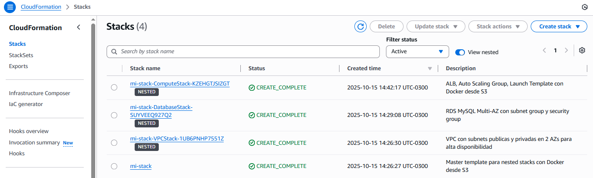
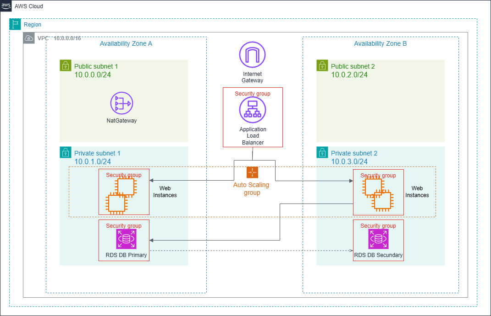

# CloudFormation Templates - AWS HA Web Application

Este directorio contiene los templates de CloudFormation para desplegar la arquitectura de alta disponibilidad con ALB, Auto Scaling, EC2 y RDS usando nested stacks con Docker desde S3.

❗❗ Recordar limpiar el ambiente luego de tus pruebas porque podes incurrir en costos de aws. Seguir la guia en esta documentación.

## Prerrequisitos

1. **Cuenta de AWS y AWS CLI configurado** con credenciales válidas
2. **Docker** instalado localmente
3. **Permisos IAM** para crear recursos (VPC, EC2, RDS, IAM, etc.)
4. **Importante!!**
Posicionarse en la terminal en el directorio cloudformation: "..\labs-aws-llb\HA_ALB-AS-EC2-RDS\cloudformation"

## 📁 Estructura de Templates

```
cloudFormation/
├── master-docker.yaml      # Template principal (nested stacks)
├── vpc.yaml               # VPC, subnets, IGW, NAT Gateway, security groups
├── compute-docker.yaml    # ALB, Auto Scaling, EC2 con Docker desde S3
├── database.yaml          # RDS MySQL Multi-AZ con security group
├── deploy-docker.sh       # Script deployment automatizado
├── cleanup.sh             # Script de limpieza de recursos
└── README.md              # Este archivo
```

## 🚀 Deployment con Nested Stacks + Docker

Esta implementación usa nested stacks de CloudFormation con deployment de aplicación via Docker desde S3.

### 🏧 Arquitectura de Deployment

- **Modular**: Cada componente en su propio template
- **Docker**: Aplicación empaquetada y desplegada desde S3
- **Nested Stacks**: VPC → Database → Compute con dependencias
- **Auto Scaling**: 2-6 instancias t3.micro con políticas CPU


### 🔑 Crear Key Pair (Requerido)

```bash
# Crear key pair en AWS
aws ec2 create-key-pair --key-name mi-keypair --query 'KeyMaterial' --output text > mi-keypair.pem
chmod 400 mi-keypair.pem

# Verificar que existe
aws ec2 describe-key-pairs --key-names mi-keypair
```
En el directorio actual se bajará una llave con nombre similar: mi-keypair.pem

### 🚀 DEPLOYMENT AUTOMATIZADO (revisar scripts para comprender dependencias del stack)

```bash
# Hacer ejecutable el script
chmod +x deploy-cf-docker.sh

# Ejecutar deployment completo (podes cambiar "MiPassword123" es la pass es para la base de datos!)
./deploy-cf-docker.sh mi-stack mi-keypair MiPassword123

# Con bucket personalizado (opcional)
./deploy-cf-docker.sh mi-stack mi-keypair MiPassword123 mi-bucket-docker
```

### 🔄 Proceso del Script

1. **Build Docker** - Construye imagen de la aplicación
2. **Upload S3** - Sube imagen Docker y templates
3. **Deploy Master** - Despliega master-docker.yaml
4. **Nested Stacks** - VPC → Database → Compute
5. **Auto Scaling** - Instancias descargan y ejecutan Docker

❕❕IMPORTANTE: 
    -Ingresar a la consola de aws y verificar los servicios y features creados.
    -La url del ALB para visualizra la aplicacion se presenta en el ouput como:
        " alb_url = "http://aws-ha-webapp-alb-908897033.us-east-1.elb.amazonaws.com" "
    -Los servicios pueden estar inicializandose y por eso la url del outpu anterior no funciona inmediatamente. Verificar en la consola de EC2!!

Mientras se van desplegando los servicios podes ingresar a la consola de AWs-->CLoduformation y visualizar como progresa el despliegue. Ten en cuenta que puede tardar varios minutos.



## 🏗️ Arquitectura Desplegada



### Componentes Principales

- **VPC**: 10.0.0.0/16 con 2 AZs
- **Subnets Públicas**: 10.0.0.0/24, 10.0.2.0/24
- **Subnets Privadas**: 10.0.1.0/24, 10.0.3.0/24
- **ALB**: Internet-facing en subnets públicas
- **Auto Scaling**: 2-6 instancias t3.micro
- **RDS**: MySQL 8.0 Multi-AZ, db.t3.micro

### Security Groups

| Recurso | Puerto | Origen | Descripción |
|---------|--------|--------|-------------|
| ALB | 80, 443 | 0.0.0.0/0 | Tráfico web público |
| EC2 | 5000 | ALB SG | Aplicación Flask |
| EC2 | 22 | 10.0.0.0/16 | SSH interno |
| RDS | 3306 | EC2 SG | MySQL desde web servers |

## 📊 Monitoreo y Escalado

### Auto Scaling Policies

- **Scale Up**: CPU > 70% por 10 minutos
- **Scale Down**: CPU < 25% por 10 minutos
- **Cooldown**: 5 minutos entre escalados

### Health Checks

- **ALB Target Group**: `/api/health` cada 30s
- **Auto Scaling**: ELB health check con 5min grace period

## 🏧 Componentes de la Arquitectura

### VPC Stack (vpc.yaml)
- VPC 10.0.0.0/16 en 2 AZs
- Subnets públicas: 10.0.0.0/24, 10.0.2.0/24
- Subnets privadas: 10.0.1.0/24, 10.0.3.0/24
- Internet Gateway y NAT Gateway

### Database Stack (database.yaml)
- RDS MySQL 8.0 Multi-AZ
- db.t3.micro con 20GB storage
- Backups automáticos (7 días)
- Security Group restringido

### Compute Stack (compute-docker.yaml)
- Application Load Balancer
- Auto Scaling Group (2-6 instancias)
- Launch Template con Docker
- CloudWatch Alarms (CPU 70%/25%)

## 🧹 Limpieza

### Eliminación Automatizada 

```bash
chmod +x cleanup.sh
./cleanup-cf.sh mi-stack
```

**El script elimina automáticamente:**
- Stack de CloudFormation y todos sus recursos
- Buckets S3 con imágenes Docker y templates
- Todos los objetos dentro de los buckets

## 🔍 Troubleshooting

### Errores Comunes

**1. Key Pair no existe**
```bash
# Verificar key pairs disponibles
aws ec2 describe-key-pairs

# Crear nuevo key pair
aws ec2 create-key-pair --key-name mi-keypair --query 'KeyMaterial' --output text > mi-keypair.pem
```

**2. Límites de servicio**
```bash
# Verificar límites de EC2
aws service-quotas get-service-quota --service-code ec2 --quota-code L-1216C47A
```

**3. Stack rollback**
```bash
# Ver eventos del stack
aws cloudformation describe-stack-events --stack-name aws-ha-webapp

# Ver recursos fallidos
aws cloudformation list-stack-resources --stack-name aws-ha-webapp --stack-resource-status CREATE_FAILED
```

### Logs y Debugging

```bash
# Logs de instancias EC2
aws ssm start-session --target i-1234567890abcdef0

# En la instancia:
sudo journalctl -u webapp -f
sudo systemctl status webapp
```

## 💰 Estimación de Costos

### Recursos Principales - Costos (us-east-1) 
❗❗ Recordar limpiar el ambiente luego de tus pruebas porque podes incurrir en costos de aws. Seguir la guia en esta documentación.

| Recurso | Tipo | Cantidad | Costo/mes (aprox) |
|---------|------|----------|-------------------|
| EC2 | t3.micro | 2 | $16.80 |
| RDS | db.t3.micro Multi-AZ | 1 | $25.00 |
| ALB | - | 1 | $22.50 |
| NAT Gateway | - | 1 | $45.00 |
| **Total** | | | **~$109.30/mes** |

*Precios aproximados, usar [AWS Calculator](https://calculator.aws) para estimaciones precisas.*

## 📚 Referencias

- [AWS CloudFormation Best Practices](https://docs.aws.amazon.com/AWSCloudFormation/latest/UserGuide/best-practices.html)
- [AWS Well-Architected Framework](https://aws.amazon.com/architecture/well-architected/)
- [Auto Scaling Best Practices](https://docs.aws.amazon.com/autoscaling/ec2/userguide/auto-scaling-benefits.html)