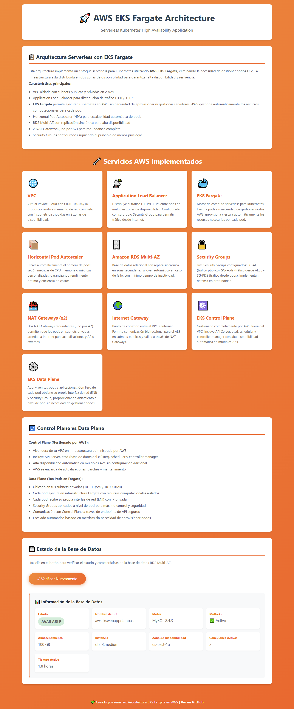

# AWS EKS Fargate - Multi-AZ Web Application

Esta es una arquitectura de referencia EKS Fargate de alta disponibilidad para desplegar una webapp. El objetivo es aprender a utilizar terraform y cloudformation, tiene pasos sin automatizar para entender lo basico del mundo kubernetes en AWS. Puedes leer completamente este Readme o ir directamente al Readme de /terraform (proximamente despliegue con cloudformation)


## 🏗️ Arquitectura Serverless


La aplicación está distribuida en dos zonas de disponibilidad (AZs) e implementa los siguientes componentes:

- **VPC**: Red virtual aislada con CIDR 10.0.0.0/16
- **Subnets Públicas**: Para ALB y NAT Gateways (10.0.0.0/24, 10.0.2.0/24)
- **Subnets Privadas**: Para tareas Fargate y RDS (10.0.1.0/24, 10.0.3.0/24)
- **Application Load Balancer**: Distribución de tráfico entre pods generados por EKS Fargate
- **EKS Fargate**: Generación de pods en 2 zonas de disponibilidad.
- **Amazon ECR**: Registro de imágenes Docker
- **RDS Multi-AZ**: Base de datos MySQL con réplica sincrónica
- **2 NAT Gateways**: Uno por AZ para alta disponibilidad
- **Security Groups**: Control de tráfico a nivel de pods y base de datos


> **📝 Nota sobre HTTPS:** Esta arquitectura usa HTTP (puerto 80). Para HTTPS necesitas un dominio propio y certificado SSL/TLS de AWS Certificate Manager (ACM) - Gratis.


## 📋 Prerrequisitos

1. **Cuenta de AWS y AWS CLI configurado**
2. **Terraform instalado (>= 1.0)**
3. **kubectl instalado** (para gestionar el cluster Kubernetes)
Hay varias maneras de instalar, una es:
- Usando `chocolatey` en Windows:
```bash
choco install kubernetes-cli
```
4. **Docker Desktop** (para build y push de imagen a ECR)

5. **Verificar versiones instaladas**:
```bash
terraform -version
kubectl version --client
```
## Manifiesto Kubernetes
-deployment.yaml
-hpa.yaml
-service.yaml

## 🔧 Componentes de la WebAPP




### Backend (Flask)

El backend está desarrollado en Python con Flask y proporciona los siguientes endpoints:

- `GET /` - Landing page principal
- `GET /api/db-status` - Estado y características de RDS (incluye nombre de BD)
- `GET /api/health` - Health check de la aplicación
- `GET /api/test-query` - Query de prueba a la base de datos

### Frontend (HTML/CSS/JavaScript)

Landing page responsive que muestra:

- Descripción de la arquitectura EKS Fargate
- Cards con información de los componentes/servicios desplegados.
- Botón interactivo para verificar el estado de RDS
- Métricas en tiempo real: nombre de BD, motor, Multi-AZ, storage, conexiones, uptime

## 📦 Instalación Local

### 1. Clonar el repositorio

```bash
git clone https://github.com/reinalau/labs-aws-llb.git
cd HA_ALB-EKS-RDS/application
```

### 2. Instalar dependencias

```bash
cd app
pip3 install -r requirements.txt
```

### 3. Configurar variables de entorno

```bash
cp .env.example .env
# Editar .env con las credenciales de tu RDS
nano .env
```

### 5. Ejecutar la aplicación

```bash
python3 app.py
```

La aplicación estará disponible en `http://localhost:5000`

## 🐳 Deployment con Docker de forma Local

### Construir la imagen

```bash
cd app
docker build -t aws-eks-app .
```

### Ejecutar el contenedor

```bash
docker run -d \
  -p 5000:5000 \
  -e DB_HOST=your-rds-endpoint.rds.amazonaws.com \
  -e DB_USER=admin \
  -e DB_PASSWORD=your-password \
  -e DB_NAME=aws_demo \
  --name aws-app \
  aws-fargate-app
```

Accede a: `http://localhost:5000`


## 🚀 DEPLOYMENT EN AWS (incluido docker)

### Opción Terraform
ir a directorio ./terraform
Para ejecutar paso a paso la implementación, leer readme.md en el correspondiente directorio.

### Opción CloudFormation ...Proximamente!!!
ir a directorio ./cloudformation
Para ejecutar paso a paso la implementación, leer readme.md en el correspondiente directorio.


## 🔐 Configuración de Seguridad

### Security Groups

**ALB Security Group:**
- Inbound: 80 (HTTP), 443 (HTTPS) desde 0.0.0.0/0
- Outbound: Todo el tráfico

**EKS Fargate cluster Security Group:**
- Inbound: 5000 desde ALB Security Group
- Outbound: Todo el tráfico

**RDS Security Group:**
- Inbound: 3306 desde EKS Fargate Security Group
- Outbound: Ninguno

### Mejores Prácticas Implementadas

✅ **CloudWatch Log groups**: Logs de contenedores Fargate centralizados
✅ **IAM Roles**: Fargate Profile
✅ **Multi-AZ**: RDS y tareas Fargate distribuidas en 2 AZs
✅ **Security Groups**: Principio de menor privilegio
✅ **EKS Fargate**: Gestion de escalado administrada por aws.

### Mejoras Futuras (No implementadas)

1. **AWS Secrets Manager** para credenciales de RDS
2. **SSL/TLS** en ALB con certificado de ACM (requiere dominio)
3. **WAF** para protección contra ataques web


### Métricas

La aplicación expone:
- Estado de la base de datos
- Número de conexiones activas
- Tiempo de uptime
- Registros en tabla demo

## 🧪 Testing en local

### Health Check

```bash
curl http://localhost:5000/api/health
```

### Database Status (si hacemos pruebas locales)

```bash
curl http://localhost:5000/api/db-status
```

## 🛠️ Troubleshooting

Leer en cada README.md de la iac (terraform y cloudformation) 


## 📄 Licencia

Este proyecto está bajo la Licencia MIT - ver el archivo [LICENSE](/LICENSE) para más detalles.

## 👥 Autor

- LauB - [@reinalau](https://github.com/reinalau)


**⚠️ Nota Importante:** Este es un proyecto educativo para aprender a deployar arquitectura serverless de alta disponibilidad con EKS Fargate en AWS. Revisar y ajustar lo necesario si estás pensando en utilizarlo a nivel productivo.