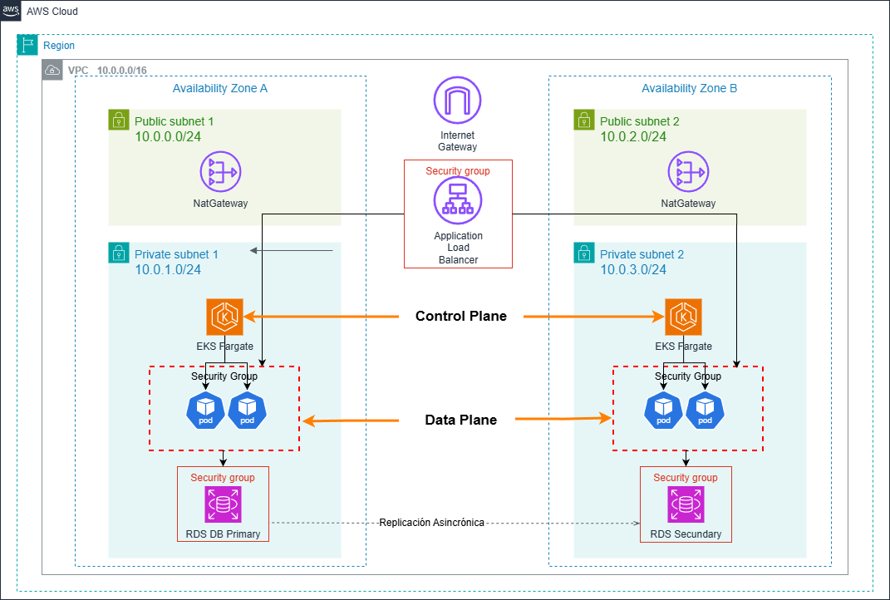
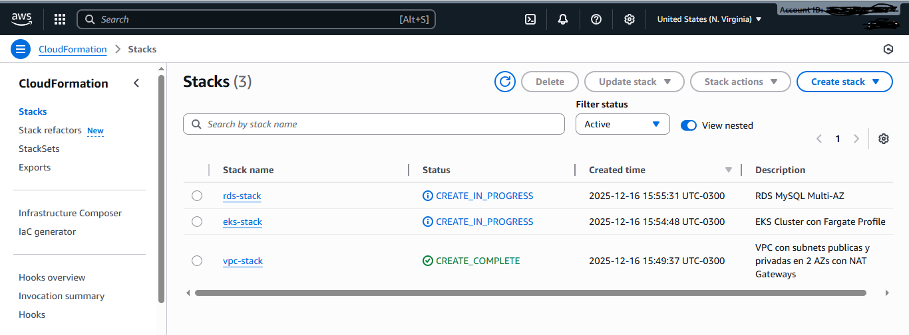

# CloudFormation - Arquitectura Alta Disponibilidad con ALB + EKS Fargate + RDS

## 📋 Descripción

Implementación de una arquitectura de alta disponibilidad en AWS usando CloudFormation con stacks separados siguiendo las mejores prácticas.

## Prerequisitos

1. **Cuenta de AWS y AWS CLI configurado**
2. **kubectl, eksctl y helm instalado** (para gestionar el cluster Kubernetes)
Hay varias maneras de instalar, una es:
- Usando `chocolatey` en Windows. Para instalar Chocolatey en Win, abrir Powershell como Administrador:

```powershell
# Instalar Chocolatey
Set-ExecutionPolicy Bypass -Scope Process -Force; [System.Net.ServicePointManager]::SecurityProtocol = [System.Net.ServicePointManager]::SecurityProtocol -bor 3072; iex ((New-Object System.Net.WebClient).DownloadString('https://community.chocolatey.org/install.ps1'))

#kubernetes cli
choco install kubernetes-cli

# Instalar Helm
choco install kubernetes-helm -y

# Instalar eksctl
choco install eksctl -y

```

3. **Docker Desktop** (para build y push de imagen a ECR)


## 📁 Estructura del Directorio (template y scripts que se usan en esta guia)

```
HA_ALB-EKS-RDS/
├── cloudformation/              # Templates de CloudFormation
│   ├── vpc.yaml                # Stack de VPC y networking
│   ├── eks-fargate.yaml        # Stack de EKS con Fargate
│   ├── rds.yaml                # Stack de RDS MySQL Multi-AZ
│   └── README.md               # Este archivo
├── app/                        # Código de la aplicación
│   ├── app.py                  # Backend Flask
│   ├── Dockerfile              # Imagen Docker
│   ├── requirements.txt        # Dependencias Python
│   └── frontend/
│       └── index.html          # Frontend de la webapp
├── deployment.yaml             # Deployment de Kubernetes (usado en deploy-k8s.sh)
├── service.yaml                # Service de Kubernetes (usado en deploy-k8s.sh)
├── hpa.yaml                    # HorizontalPodAutoscaler (usado en deploy-k8s.sh)
├── ingress.yaml                # Ingress para ALB (paso 4 del despliegue)
├── install-alb-controller.sh   # Script para instalar AWS Load Balancer Controller
├── deploy-k8s.sh               # Script para desplegar la aplicación en EKS
└── README.md                   # Documentación principal del proyecto
```

**Archivos externos usados en el despliegue:**
- `../deployment.yaml`, `../service.yaml`, `../hpa.yaml` - Manifests de Kubernetes en el directorio raíz
- `../ingress.yaml` - Configuración del Ingress para conectar ALB con EKS
- `../install-alb-controller.sh` - Script de instalación del Load Balancer Controller
- `../deploy-k8s.sh` - Script de despliegue de la aplicación
- `../app/` - Código fuente de la aplicación Flask

## 📦 Stacks de CloudFormation

Los stacks están separados para facilitar el mantenimiento y seguir las mejores prácticas:

1. **vpc.yaml** - Red base (VPC, Subnets, NAT Gateways, Security Groups)
2. **eks-fargate.yaml** - Cluster EKS con Fargate Profile
3. **rds.yaml** - Base de datos RDS MySQL Multi-AZ


## 🏗️ Arquitectura

La arquitectura incluye:
- **VPC** con subnets públicas y privadas en 2 AZs
- **NAT Gateways** (2) para alta disponibilidad
- **EKS Cluster** con Fargate Profile en subnets privadas
- **RDS MySQL Multi-AZ** en subnets privadas
- **ALB** creado automáticamente por AWS Load Balancer Controller (vía Ingress)




## 💰 Estimación de costos

**ADVERTENCIA**: Esta arquitectura genera costos en AWS.

### Costo mensual (24/7)

- **NAT Gateways**: ~$0.045/hora x 2 = ~$65/mes
- **EKS Cluster**: $0.10/hora = ~$73/mes
- **RDS Multi-AZ**: ~$0.034/hora x 2 = ~$50/mes
- **ALB** (creado por Ingress): ~$0.0225/hora = ~$16/mes

**Total estimado**: ~$204/mes

### Costo Ajustado para Pruebas (4 horas)

Para analizar y probar la arquitectura durante 4 horas:

- **NAT Gateways**: $0.045/hora x 2 x 4h = **$0.36**
- **EKS Cluster**: $0.10/hora x 4h = **$0.40**
- **RDS Multi-AZ**: $0.034/hora x 2 x 4h = **$0.27**
- **ALB**: $0.0225/hora x 4h = **$0.09**
- **Transferencia de datos**: ~**$0.10** (estimado)

**Total laboratorio (4 horas)**: ~**$1.22 USD**

💡 **Recomendación**: 
- Destruir los recursos inmediatamente después de las pruebas
- El costo real puede variar según la región y el uso de transferencia de datos
- Los NAT Gateways son el componente más costoso (~30% del total)


## 🚀 DEPLOYMENT AWS

### Validar cada stack de Cloudformation (Opcional)
Para que los stack esten **OK**, la ejecución debe arrojar: 

✅ Parameters: Los parámetros definidos en el template
✅ Description: La descripción del template
✅ Capabilities: Si requiere CAPABILITY_IAM o CAPABILITY_NAMED_IAM

Si NO muestra errores de sintaxis, el YAML es VÁLIDO.

```bash
aws cloudformation validate-template --template-body file://vpc.yaml
aws cloudformation validate-template --template-body file://eks-fargate.yaml
aws cloudformation validate-template --template-body file://rds.yaml
```

### Seguir este orden de despliegue
Los stacks deben desplegarse en el siguiente orden debido a las dependencias:

```bash
# 1. Desplegar VPC (base de todo)
aws cloudformation create-stack \
  --stack-name vpc-stack \
  --template-body file://vpc.yaml \
  --parameters ParameterKey=ProjectName,ParameterValue=eks-fargate-lab

# 2. Desplegar EKS Cluster
aws cloudformation create-stack \
  --stack-name eks-stack \
  --template-body file://eks-fargate.yaml \
  --parameters \
    ParameterKey=ProjectName,ParameterValue=eks-fargate-lab \
    ParameterKey=VPCStackName,ParameterValue=vpc-stack \
  --capabilities CAPABILITY_NAMED_IAM

# 3. Desplegar RDS
aws cloudformation create-stack \
  --stack-name rds-stack \
  --template-body file://rds.yaml \
  --parameters \
    ParameterKey=ProjectName,ParameterValue=eks-fargate-lab \
    ParameterKey=VPCStackName,ParameterValue=vpc-stack \
    ParameterKey=DBUsername,ParameterValue=admin \
    ParameterKey=DBPassword,ParameterValue=TuPasswordSeguro123
```

Es recomendable entrar a la Consola de aws y mirar el estado de los stack:
- CloudFormation > Stacks 



Nota: El stack de EKS es el que mas tarda en desplegarse. Paciencia, esperar 16 minutos aprox...y tomar un ☕

### Verificar el estado de los stacks

```bash
# Ver todos los stacks
aws cloudformation list-stacks --stack-status-filter CREATE_COMPLETE

# Ver detalles de un stack específico
aws cloudformation describe-stacks --stack-name vpc-stack
```

### Obtener outputs

```bash
# Obtener el endpoint de RDS
aws cloudformation describe-stacks \
  --stack-name rds-stack \
  --query 'Stacks[0].Outputs[?OutputKey==`DBInstanceEndpoint`].OutputValue' \
  --output text

# Obtener el nombre del cluster EKS
aws cloudformation describe-stacks \
  --stack-name eks-stack \
  --query 'Stacks[0].Outputs[?OutputKey==`EKSClusterName`].OutputValue' \
  --output text
```

-->Estas 2 salidas si queres podes copiarlas a un notepad para tenerlas a mano.
-->Podemos revisar los servicios creados en la Consola de AWS:
- Aurora and RDS  > Databases > Ver la base de datos creada-
- Amazon Elastic Kubernetes Service > Clusters > Ver Cluster creado


## 🔧 Configuración de kubectl

Después de desplegar el cluster EKS ("CREATE_COMPLETE" en CloudFormation):

```bash
# Configurar kubectl
aws eks update-kubeconfig --name eks-fargate-lab-cluster --region us-east-1

# Verificar la conexión
kubectl get nodes
kubectl get pods -A
```
Nota: No vamos a nodes pero sí pods (van a estar en pending)

## ⚙️ Configurar CoreDNS para Fargate

**IMPORTANTE**: Por defecto, CoreDNS no se ejecuta en Fargate. Debes parchear el deployment:

```bash
# Remover la anotación que impide que CoreDNS se ejecute en Fargate (si arroja invalido no tiene importancia)
kubectl patch deployment coredns \
    -n kube-system \
    --type json \
    -p='[{"op": "remove", "path": "/spec/template/metadata/annotations/eks.amazonaws.com~1compute-type"}]'

# Reiniciar CoreDNS
kubectl rollout restart -n kube-system deployment/coredns

# Verificar que los pods estén corriendo (esperar 1-2 minutos, kube-system es el namespace)
kubectl get pods -n kube-system
```

Los pods de CoreDNS deben cambiar de `Pending` a `Running`. Ejemplo:
NAME                       READY   STATUS    RESTARTS   AGE
coredns-544685dc84-5tgl4   1/1     Running   0          3m3s
coredns-544685dc84-9j7lw   1/1     Running   0          3m3s

## Post-Deployment: **DESPLEGAR APLICACION**

Después de configurar kubectl, desplegar la aplicación en el cluster EKS, siguiendo estos pasos:

### 1. **Crear imagen Docker y subirla a ECR**

**Nota**: Reemplazar `<account-id>` con tu AWS Account ID en TODOS los comandos.

```bash
# Obtener Account ID
aws sts get-caller-identity --query Account --output text

# Crear repositorio ECR
aws ecr create-repository --repository-name aws-eks-webapp-repo --region us-east-1

# Login a ECR
aws ecr get-login-password --region us-east-1 | docker login --username AWS --password-stdin <account-id>.dkr.ecr.us-east-1.amazonaws.com

# Build, tag y push de imagen . (Posicionarse en el directorio app)
cd ../app
docker build -t aws-eks-webapp-repo .
docker tag aws-eks-webapp-repo:latest <account-id>.dkr.ecr.us-east-1.amazonaws.com/aws-eks-webapp-repo:latest
docker push <account-id>.dkr.ecr.us-east-1.amazonaws.com/aws-eks-webapp-repo:latest

```
-->Podemos revisar en la Consola de AWS nuestro repositorio ECR con la imagen de contendor subida:
 - Amazon ECR > Private registry > Repositories

### 2. **Instalar AWS Load Balancer Controller**

Posicionarse en el directorio raíz, donde se encuentran los sh: `HA_ALB-EKS-RDS`

```bash
./install-alb-controller.sh
```
Cuando terminas de ejecutar este sh no deberia arrojar error. En el caso de error, ir a la sección **Limpieza** para comenzar el proceso nuevamente...tal vez algo olvidaste de ejecutar.

Verificar hasta que el controller este listo 2/2 (esperar unos minutos):
```bash
kubectl get deployment -n kube-system aws-load-balancer-controller
kubectl get pods -n kube-system | grep aws-load-balancer
```


### 3. **Desplegar aplicación en pods de EKS**

Revisar `deploy-k8s.sh` antes de ejecutar. Este script despliega: deployment, service y HPA.

```bash
./deploy-k8s.sh
```
Deberiamos visualizar en una de las lineas de salida: ✅ Despliegue completado!

### 4. **Aplicar Ingress**

Conecta el ALB con el servicio de EKS.

```bash
kubectl apply -f ingress.yaml
```
Opcional: Podemos ver que ahora en NameSpace por default se desplego la aplicacion en eks con el comando:
kubectl get pods -o wide

### 5. **Obtener URL del ALB y testear**

```bash
# Ver el DNS del ALB creado por el Ingress
kubectl get ingress aws-eks-webapp-ingress

# Esperar a que el ALB esté listo (puede tardar 2-3 minutos)
kubectl get ingress -w
```

Acceder a la URL mostrada en la columna `ADDRESS` y se deberia mostrar la web desplegada. Tener en cuenta que se despliega con http.
Opcional: Con este comando rapido podemos ver si hubo algun error en los logs -->
kubectl get events --sort-by='.lastTimestamp' | grep ingress


## 🗑️ Eliminación de recursos

**IMPORTANTE**: Eliminar en orden inverso al despliegue para evitar recursos huérfanos.

Opcional: Una manera controlada de eliminar y que comprendamos lo que estamos haciendo, es copiar comando por comando e ir ejecutandolos. Los comandos estan ejecutados y validados con *Git Bash*

```bash
# 1. Eliminar recursos de Kubernetes (esto elimina el ALB automáticamente)
kubectl delete ingress aws-eks-webapp-ingress
kubectl delete -f ../deployment.yaml
kubectl delete -f ../service.yaml
kubectl delete -f ../hpa.yaml

# Esperar a que el ALB se elimine completamente
echo "Esperando eliminación del ALB..."
sleep 90

# 2. Eliminar imágenes y repositorio ECR
aws ecr batch-delete-image \
    --repository-name aws-eks-webapp-repo \
    --image-ids imageTag=latest \
    --region us-east-1 2>/dev/null || true

aws ecr delete-repository \
    --repository-name aws-eks-webapp-repo \
    --region us-east-1 \
    --force 2>/dev/null || true

# 3. Eliminar CloudWatch Log Groups
LOG_GROUP_NAME="/aws/eks/eks-fargate-lab-cluster/cluster"

MSYS_NO_PATHCONV=1 aws logs delete-log-group \
    --log-group-name "$LOG_GROUP_NAME" \
    --region us-east-1


# 3.5. Eliminar política IAM del Load Balancer Controller agregando en install-alb-controller.sh
ACCOUNT_ID=$(aws sts get-caller-identity --query Account --output text)
POLICY_ARN="arn:aws:iam::${ACCOUNT_ID}:policy/AWSLoadBalancerControllerIAMPolicy"

aws iam delete-policy --policy-arn $POLICY_ARN 2>/dev/null || echo "Política IAM ya eliminada"

# 4. Eliminar RDS
aws cloudformation delete-stack --stack-name rds-stack
echo "Esperando eliminación de RDS..."
aws cloudformation wait stack-delete-complete --stack-name rds-stack

# 5. Eliminar EKS (puede tardar varios minutos)
aws cloudformation delete-stack --stack-name eks-stack
echo "Esperando eliminación de EKS..."
aws cloudformation wait stack-delete-complete --stack-name eks-stack

# 6. Eliminar stack de IAM ServiceAccount (creado por eksctl - DESPUÉS de EKS)
aws cloudformation delete-stack \
    --stack-name eksctl-eks-fargate-lab-cluster-addon-iamserviceaccount-kube-system-aws-load-balancer-controller \
    2>/dev/null || echo "Stack de IAM ServiceAccount ya eliminado"

echo "Esperando eliminación de IAM ServiceAccount..."
aws cloudformation wait stack-delete-complete \
    --stack-name eksctl-eks-fargate-lab-cluster-addon-iamserviceaccount-kube-system-aws-load-balancer-controller \
    2>/dev/null || true

# 7. Verificar y eliminar ENIs huérfanas (si existen)
VPC_ID=$(aws cloudformation describe-stacks \
    --stack-name vpc-stack \
    --query 'Stacks[0].Outputs[?OutputKey==`VPCId`].OutputValue' \
    --output text 2>/dev/null)

if [ ! -z "$VPC_ID" ]; then
    echo "Verificando ENIs huérfanas en VPC $VPC_ID..."
    aws ec2 describe-network-interfaces \
        --filters "Name=vpc-id,Values=$VPC_ID" \
        --query 'NetworkInterfaces[?Status==`available`].NetworkInterfaceId' \
        --output text | xargs -r -n1 aws ec2 delete-network-interface --network-interface-id 2>/dev/null || true
    sleep 30
fi

# 8. Eliminar VPC (después de que todo lo demás esté eliminado)
aws cloudformation delete-stack --stack-name vpc-stack
echo "Esperando eliminación de VPC..."
aws cloudformation wait stack-delete-complete --stack-name vpc-stack

echo "✅ Todos los recursos eliminados exitosamente!"
```

### Verificar eliminación completa

```bash
# Verificar que no queden stacks
aws cloudformation list-stacks \
    --stack-status-filter CREATE_COMPLETE UPDATE_COMPLETE \
    --query 'StackSummaries[?contains(StackName, `eks-fargate-lab`) || contains(StackName, `vpc-stack`) || contains(StackName, `rds-stack`) || contains(StackName, `eks-stack`)].StackName'

# Verificar que no queden repositorios ECR
aws ecr describe-repositories --query 'repositories[?repositoryName==`aws-eks-webapp-repo`]'

# Verificar que no queden log groups
aws logs describe-log-groups --query 'logGroups[?starts_with(logGroupName, `/aws/eks/eks-fargate-lab`)]'

```
+++++++++++++++++++++++++++++++++++++++++++++++++++++++++++++++++++++++++++++++++++++++

## 📊 Parámetros configurables

### vpc.yaml
- `ProjectName`: Nombre del proyecto (default: eks-fargate-lab)

### eks-fargate.yaml
- `ProjectName`: Nombre del proyecto
- `VPCStackName`: Nombre del stack de VPC (default: vpc-stack)

### rds.yaml
- `ProjectName`: Nombre del proyecto
- `VPCStackName`: Nombre del stack de VPC
- `DBInstanceClass`: Clase de instancia (default: db.t3.micro)
- `DBUsername`: Usuario de la base de datos (default: admin)
- `DBPassword`: Password de la base de datos (mínimo 8 caracteres)


## 🔒 Security Groups

Los security groups están configurados para:
- ALB: Acepta tráfico HTTP (80) desde Internet
- EKS: Acepta tráfico en puerto 5000 desde ALB
- RDS: Acepta tráfico MySQL (3306) desde EKS y subnets privadas

## 🔧 Troubleshooting

### Verificar estado de recursos

```bash
# Ver todos los pods
kubectl get pods -A

# Ver estado de deployments
kubectl get deployments -A

# Ver ingress
kubectl get ingress

# Ver servicios
kubectl get svc -A
```

### Ver logs de componentes

```bash
# Logs del AWS Load Balancer Controller
kubectl logs -n kube-system -l app.kubernetes.io/name=aws-load-balancer-controller --tail=100

# Logs de CoreDNS
kubectl logs -n kube-system -l k8s-app=kube-dns --tail=50

# Logs de la aplicación
kubectl logs -l app=aws-eks-webapp --tail=50

# Ver eventos del cluster
kubectl get events --sort-by='.lastTimestamp' --all-namespaces
```

### Problemas comunes

**1. Pods en estado Pending**
```bash
# Verificar que CoreDNS esté corriendo
kubectl get pods -n kube-system

# Si CoreDNS está Pending, aplicar el patch
kubectl patch deployment coredns -n kube-system --type json \
  -p='[{"op": "remove", "path": "/spec/template/metadata/annotations/eks.amazonaws.com~1compute-type"}]'
kubectl rollout restart -n kube-system deployment/coredns
```

**2. Ingress sin ADDRESS**
```bash
# Ver eventos del ingress
kubectl describe ingress aws-eks-webapp-ingress

# Ver logs del controller
kubectl logs -n kube-system -l app.kubernetes.io/name=aws-load-balancer-controller

# Verificar que el ServiceAccount tenga la anotación correcta
kubectl describe serviceaccount aws-load-balancer-controller -n kube-system
```

**3. Error de permisos IAM**
```bash
# Verificar política IAM
ACCOUNT_ID=$(aws sts get-caller-identity --query Account --output text)
aws iam get-policy --policy-arn arn:aws:iam::${ACCOUNT_ID}:policy/AWSLoadBalancerControllerIAMPolicy

# Si falta, descargar política actualizada
curl -k -o iam-policy.json https://raw.githubusercontent.com/kubernetes-sigs/aws-load-balancer-controller/main/docs/install/iam_policy.json

# Crear nueva versión de la política
aws iam create-policy-version \
  --policy-arn arn:aws:iam::${ACCOUNT_ID}:policy/AWSLoadBalancerControllerIAMPolicy \
  --policy-document file://iam-policy.json \
  --set-as-default
```

**4. Aplicación no responde**
```bash
# Verificar que los pods estén corriendo
kubectl get pods -l app=aws-eks-webapp

# Ver logs de la aplicación
kubectl logs -l app=aws-eks-webapp --tail=100

# Verificar conectividad con RDS
kubectl exec -it $(kubectl get pod -l app=aws-eks-webapp -o jsonpath='{.items[0].metadata.name}') -- curl localhost:5000/api/health
```

### Solución definitiva: Reinstalación limpia

Si los problemas persisten, eliminar todo y volver a desplegar:

```bash
# 1. Eliminar recursos de Kubernetes
kubectl delete ingress aws-eks-webapp-ingress
kubectl delete -f ../deployment.yaml
kubectl delete -f ../service.yaml
kubectl delete -f ../hpa.yaml

# 2. Desinstalar Load Balancer Controller
helm uninstall aws-load-balancer-controller -n kube-system

# 3. Eliminar stacks de CloudFormation
aws cloudformation delete-stack --stack-name rds-stack
aws cloudformation delete-stack --stack-name eks-stack
aws cloudformation wait stack-delete-complete --stack-name eks-stack
aws cloudformation delete-stack --stack-name vpc-stack

# 4. Limpiar recursos residuales
ACCOUNT_ID=$(aws sts get-caller-identity --query Account --output text)
aws iam delete-policy --policy-arn arn:aws:iam::${ACCOUNT_ID}:policy/AWSLoadBalancerControllerIAMPolicy 2>/dev/null || true
aws ecr delete-repository --repository-name aws-eks-webapp-repo --force 2>/dev/null || true

# 5. Volver a desplegar desde el paso 1 del README
```

## 📝 Notas importantes

1. Los logs de EKS tienen retención de 1 día para minimizar costos
2. RDS tiene backups deshabilitados (BackupRetentionPeriod: 0)
3. RDS no tiene protección contra eliminación (DeletionProtection: false)
4. Los NAT Gateways son necesarios para que Fargate descargue imágenes de contenedores
5. El AWS Load Balancer Controller puede tardar 2-3 minutos en crear el ALB
6. Si hay errores de permisos IAM, verificar que la política esté actualizada

## 🔗 Referencias

- [AWS CloudFormation Best Practices](https://docs.aws.amazon.com/AWSCloudFormation/latest/UserGuide/best-practices.html)
- [Amazon EKS User Guide](https://docs.aws.amazon.com/eks/latest/userguide/)
- [AWS Fargate on EKS](https://docs.aws.amazon.com/eks/latest/userguide/fargate.html)
