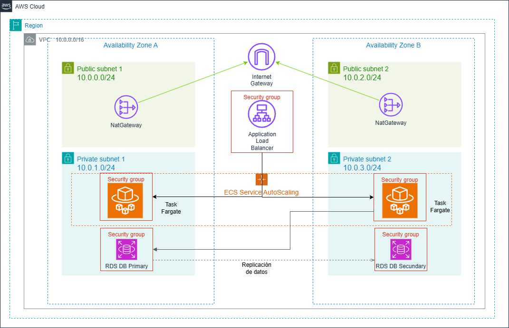

# AWS ECS Fargate - Serverless Multi-AZ Web Application

Esta es una arquitectura de referencia serverless que implementa las mejores prácticas de AWS para aplicaciones web de alta disponibilidad usando ECS Fargate, con una landing page interactiva que muestra el estado de la infraestructura en tiempo real.

**Nota**: Todas las instrucciones de apertura de permisos (chmod), si trabajamos en Windows no son necesarias.

## 🏗️ Arquitectura Serverless



La aplicación está distribuida en dos zonas de disponibilidad (AZs) e implementa los siguientes componentes:

- **VPC**: Red virtual aislada con CIDR 10.0.0.0/16
- **Subnets Públicas**: Para ALB y NAT Gateways (10.0.0.0/24, 10.0.2.0/24)
- **Subnets Privadas**: Para tareas Fargate y RDS (10.0.1.0/24, 10.0.3.0/24)
- **Application Load Balancer**: Distribución de tráfico entre tareas Fargate
- **ECS Fargate**: Contenedores serverless sin gestión de servidores
- **Amazon ECR**: Registro de imágenes Docker
- **RDS Multi-AZ**: Base de datos MySQL con réplica sincrónica
- **2 NAT Gateways**: Uno por AZ para alta disponibilidad
- **Security Groups**: Control de tráfico a nivel de tarea y base de datos

📊 Configuración de ECS Service Auto Scaling
MinCapacity: 2          # Mínimo 2 tareas
MaxCapacity: 6          # Máximo 6 tareas  
DesiredCount: 2         # Inicia con 2 tareas
CPU: 256 (0.25 vCPU)    # Por tarea
Memory: 512 MB          # Por tarea

📈 Políticas de Escalado
Target Tracking: CPU promedio 70%
Scale Out Cooldown: 60 segundos
Scale In Cooldown: 300 segundos

> **📝 Nota sobre HTTPS:** Esta arquitectura usa HTTP (puerto 80). Para HTTPS necesitas un dominio propio y certificado SSL/TLS de AWS Certificate Manager (ACM) - Gratis.


## 📋 Prerrequisitos

- Cuenta de AWS activa y AWS CLI configurado
- Terraform >= 1.0 o CloudFormation
- Git
- Python 3.11+
- Docker Desktop

## 🚀 Estructura del Proyecto

```
HA_ALB-FARGATE-RDS/
├── README.md                    # Este archivo
├── recursos/
│   ├── ELB-ECSFARGATE-RDS.png  # Diagrama de arquitectura Fargate
│   └── ELB-ECSFARGATE-RDS.drawio # Archivo fuente del diagrama (Draw.io)
├── terraform/                   # Implementación con Terraform
│   ├── main.tf                 # Configuración principal y provider AWS
│   ├── vpc.tf                  # VPC, subnets, 2 NAT Gateways, security groups
│   ├── alb.tf                  # Application Load Balancer (target type: ip)
│   ├── ecs-fargate.tf          # ECS Cluster, Task Definition, Service, Auto Scaling
│   ├── rds.tf                  # RDS MySQL Multi-AZ
│   ├── variables.tf            # Variables de entrada
│   ├── outputs.tf              # Outputs (ALB, ECR, ECS, RDS)
│   ├── terraform.tfvars.example # Ejemplo de variables
│   ├── ecr-push.sh             # Script para build y push Docker a ECR
│   └── README.md               # Instrucciones de deployment Terraform
├── cloudFormation/             # Implementación con CloudFormation
│   ├── master-docker.yaml      # Template principal (nested stacks)
│   ├── vpc.yaml                # VPC, subnets, 2 NAT Gateways
│   ├── fargate-docker.yaml     # ALB, ECS Fargate Service, Auto Scaling
│   ├── database.yaml           # RDS MySQL Multi-AZ
│   ├── deploy-cf-docker.sh     # Script de deployment con ECR
│   ├── cleanup-cf.sh           # Script de limpieza
│   └── README.md               # Instrucciones de deployment CloudFormation
└── application/                # Aplicación web Flask
    ├── app.py                  # Backend Flask con endpoints
    ├── requirements.txt        # Dependencias Python
    ├── Dockerfile             # Imagen Docker optimizada (Alpine, multi-stage)
    ├── .env.example           # Variables de entorno de ejemplo
    └── frontend/
        └── index.html         # Landing page interactiva
```

## 🔧 Componentes de la Aplicación

### Backend (Flask)

El backend está desarrollado en Python con Flask y proporciona los siguientes endpoints:

- `GET /` - Landing page principal
- `GET /api/db-status` - Estado y características de RDS (incluye nombre de BD)
- `GET /api/health` - Health check de la aplicación
- `GET /api/test-query` - Query de prueba a la base de datos

### Frontend (HTML/CSS/JavaScript)

Landing page responsive con tema rosado que muestra:

- Descripción de la arquitectura serverless con ECS Fargate
- Cards con información de cada servicio AWS (ECS, Fargate, ECR, etc.)
- Botón interactivo para verificar el estado de RDS
- Métricas en tiempo real: nombre de BD, motor, Multi-AZ, storage, conexiones, uptime

## 📦 Instalación Local

### 1. Clonar el repositorio

```bash
git clone https://github.com/reinalau/labs-aws-llb.git
cd HA_ALB-FARGATE-RDS/application
```

### 2. Instalar dependencias

```bash
pip3 install -r requirements.txt
```

### 3. Configurar variables de entorno

```bash
cp .env.example .env
# Editar .env con las credenciales de tu RDS
nano .env
```

### 5. Ejecutar la aplicación

```bash
python3 app.py
```

La aplicación estará disponible en `http://localhost:5000`

## 🐳 Deployment con Docker de forma Local

### Construir la imagen

```bash
cd application
docker build -t aws-fargate-app .
```

### Ejecutar el contenedor

```bash
docker run -d \
  -p 5000:5000 \
  -e DB_HOST=your-rds-endpoint.rds.amazonaws.com \
  -e DB_USER=admin \
  -e DB_PASSWORD=your-password \
  -e DB_NAME=aws_demo \
  --name aws-app \
  aws-fargate-app
```

Accede a: `http://localhost:5000`


## 🚀 DEPLOYMENT EN AWS (incluido docker)

### Opción CloudFormation
ir a directorio ./cloudformation
Para ejecutar paso a paso la implementación, leer readme.md en el correspondiente directorio.

### Opción Terraform
ir a directorio ./terraform
Para ejecutar paso a paso la implementación, leer readme.md en el correspondiente directorio.

## 🔐 Configuración de Seguridad

### Security Groups

**ALB Security Group:**
- Inbound: 80 (HTTP), 443 (HTTPS) desde 0.0.0.0/0
- Outbound: Todo el tráfico

**Fargate Tasks Security Group:**
- Inbound: 5000 desde ALB Security Group
- Outbound: Todo el tráfico

**RDS Security Group:**
- Inbound: 3306 desde Fargate Security Group
- Outbound: Ninguno

### Mejores Prácticas Implementadas

✅ **CloudWatch Logs**: Logs de contenedores Fargate centralizados
✅ **IAM Roles**: ECS Task Execution Role y Task Role
✅ **Multi-AZ**: RDS y tareas Fargate distribuidas en 2 AZs
✅ **Security Groups**: Principio de menor privilegio
✅ **Auto Scaling**: Target tracking basado en CPU

### Mejoras Futuras (No implementadas)

1. **AWS Secrets Manager** para credenciales de RDS
2. **SSL/TLS** en ALB con certificado de ACM (requiere dominio)
3. **WAF** para protección contra ataques web
4. **Fargate Spot** para reducción de costos (~70% más barato)

### Métricas

La aplicación expone:
- Estado de la base de datos
- Número de conexiones activas
- Tiempo de uptime
- Registros en tabla demo

## 🧪 Testing en local

### Health Check

```bash
curl http://localhost:5000/api/health
```

### Database Status

```bash
curl http://localhost:5000/api/db-status
```

## 🛠️ Troubleshooting

### Tareas Fargate no inician

1. Verificar logs de CloudWatch (desde tu máquina local):
```bash
aws logs tail /ecs/aws-ha-webapp --follow
```

2. Verificar estado del servicio ECS:
```bash
aws ecs describe-services --cluster aws-ha-webapp-cluster --services aws-ha-webapp-service
```

3. Verificar que la imagen existe en ECR:
```bash
aws ecr describe-images --repository-name aws-ha-webapp-repo
```

### Error 502 en ALB

1. Verificar que las tareas estén "healthy" en Target Group
2. Verificar health check endpoint `/api/health`
3. Verificar Security Groups (ALB → Fargate → RDS)
4. Verificar que RDS esté "available"

```bash
# Ver logs de CloudWatch (desde tu máquina local con AWS CLI)
aws logs tail /ecs/aws-ha-webapp --follow

# Ver estado de tareas
aws ecs list-tasks --cluster aws-ha-webapp-cluster --service aws-ha-webapp-service
```

### Health Status "UNKNOWN"

Es normal durante los primeros 60 segundos (grace period). Si persiste:
- Verificar que la app responda en `/api/health`
- Verificar logs de CloudWatch
- Verificar conectividad a RDS


## 📄 Licencia

Este proyecto está bajo la Licencia MIT - ver el archivo [LICENSE](LICENSE) para más detalles.

## 👥 Autores

- LauB - [@reinalau](https://github.com/reinalau)


## 💰 Estimación de Costos (us-east-1)

| Recurso | Tipo | Cantidad | Costo/mes (aprox) |
|---------|------|----------|-------------------|
| Fargate | 0.25 vCPU, 0.5 GB | 2 tareas 24/7 | ~$15.00 |
| RDS | db.t3.micro Multi-AZ | 1 | $25.00 |
| ALB | - | 1 | $22.50 |
| NAT Gateway | - | 2 | $90.00 |
| ECR | Storage | ~100 MB | $0.01 |
| CloudWatch Logs | 1 GB | - | $0.50 |
| **Total** | | | **~$153/mes** |

*Usar [AWS Calculator](https://calculator.aws) para estimaciones precisas.*

**⚠️ Nota Importante:** Este es un proyecto educativo para aprender a deployar arquitectura serverless de alta disponibilidad con ECS Fargate en AWS. Revisar y ajustar lo necesario si estás pensando en utilizarlo a nivel productivo.