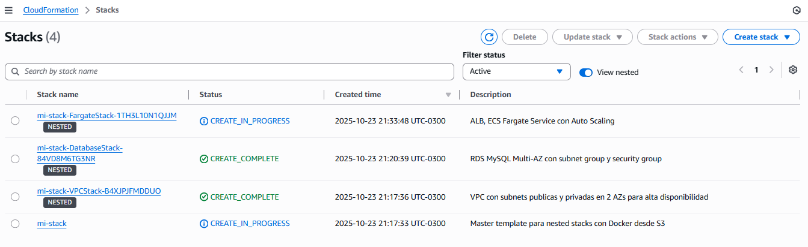
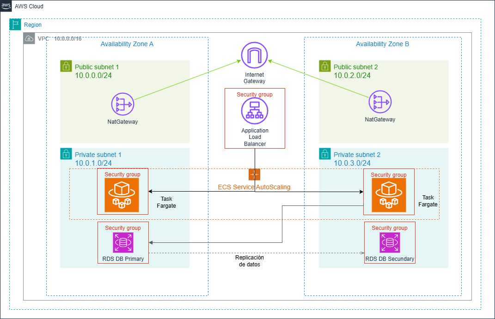

# CloudFormation Templates - AWS ECS Fargate HA Application

Este directorio contiene los templates de CloudFormation para desplegar la arquitectura serverless de alta disponibilidad con ALB, ECS Fargate y RDS usando nested stacks con Docker desde ECR.

❗❗ Recordar limpiar el ambiente luego de tus pruebas porque podes incurrir en costos de aws. Seguir la guía en esta documentación.

## Prerrequisitos

1. **Cuenta de AWS y AWS CLI configurado** con credenciales válidas
2. **Docker** instalado localmente
3. **Permisos IAM** para crear recursos (VPC, ECS, ECR, RDS, IAM, etc.)
4. **Importante!!**
Posicionarse en la terminal en el directorio cloudformation: "..\labs-aws-llb\HA_ALB-FARGATE-RDS\cloudformation"

## 📁 Estructura de Templates

```
cloudformation/
├── master-docker.yaml      # Template principal (nested stacks)
├── vpc.yaml               # VPC, subnets, IGW, 2 NAT Gateways, security groups
├── fargate-docker.yaml    # ALB, ECS Fargate Service, Auto Scaling
├── database.yaml          # RDS MySQL Multi-AZ con security group
├── deploy-cf-docker.sh    # Script deployment automatizado
├── cleanup-cf.sh          # Script de limpieza de recursos
└── README.md              # Este archivo
```

## 🚀 Deployment con Nested Stacks + ECS Fargate

Esta implementación usa nested stacks de CloudFormation con deployment serverless de contenedores via ECS Fargate desde ECR.

### 🏧 Arquitectura de Deployment

- **Serverless**: Sin gestión de servidores, AWS administra la infraestructura
- **Modular**: Cada componente en su propio template
- **Docker**: Aplicación empaquetada y desplegada desde Amazon ECR
- **Nested Stacks**: VPC → Database → Fargate con dependencias
- **Service Auto Scaling**: 2-6 tareas Fargate con políticas CPU

> **📝 Nota sobre HTTPS:** Esta arquitectura usa HTTP (puerto 80) para simplificar el laboratorio. Para habilitar HTTPS necesitas:
> - Un dominio propio registrado
> - Certificado SSL/TLS de AWS Certificate Manager (ACM) - Gratis
> - Modificar el ALB para agregar listener en puerto 443
> - Validar el certificado vía DNS o email
> 
> Sin certificado SSL/TLS no es posible usar HTTPS. ACM es gratuito pero requiere un dominio (~$12/año).

### 🚀 DEPLOYMENT AUTOMATIZADO

```bash
# Hacer ejecutable el script
chmod +x deploy-cf-docker.sh

# Ejecutar deployment completo
# Uso: ./deploy-cf-docker.sh [stack-name] [db-password]
./deploy-cf-docker.sh mi-stack MySecurePassword123!
```

### 🔄 Proceso del Script

1. **Crear ECR** - Crea repositorio en Amazon ECR
2. **Autenticar Docker** - Login en ECR con credenciales AWS
3. **Build Docker** - Construye imagen de la aplicación
4. **Push ECR** - Sube imagen al repositorio ECR
5. **Upload S3** - Sube templates nested a S3
6. **Deploy Master** - Despliega master-docker.yaml
7. **Nested Stacks** - VPC → Database → Fargate
8. **ECS Service** - Fargate pull imagen desde ECR y ejecuta tareas

❕❕IMPORTANTE: 
- Ingresar a la consola de AWS y verificar los servicios creados
- La URL del ALB se presenta en el output parecido a:
  `Application URL: http://mi-sta-appli-qgx5db9jxiob-682362852.us-east-1.elb.amazonaws.com/`
- Los servicios pueden tardar unos minutos en inicializarse
- Verificar en la consola: **ECS → Clusters → Services → Tasks**

Mientras se despliegan los servicios, ingresa a la consola de AWS → CloudFormation y visualiza el progreso. El deployment puede tardar 10-15 minutos.



## 🏗️ Arquitectura Desplegada



### Componentes Principales

- **VPC**: 10.0.0.0/16 con 2 AZs
- **Subnets Públicas**: 10.0.0.0/24, 10.0.2.0/24
- **Subnets Privadas**: 10.0.1.0/24, 10.0.3.0/24
- **ALB**: Internet-facing en subnets públicas
- **ECS Fargate**: 2-6 tareas serverless (256 CPU, 512 MB)
- **RDS**: MySQL 8.0 Multi-AZ, db.t3.micro
- **NAT Gateways**: 2 (uno por AZ) para alta disponibilidad

### Security Groups

| Recurso | Puerto | Origen | Descripción |
|---------|--------|--------|-------------|
| ALB | 80 | 0.0.0.0/0 | Tráfico web público |
| Fargate Tasks | 5000 | ALB SG | Aplicación Flask |
| RDS | 3306 | Fargate SG | MySQL desde tareas Fargate |

## 📊 Monitoreo y Escalado

### ECS Service Auto Scaling

- **Target Tracking**: CPU promedio 70%
- **Scale Out Cooldown**: 60 segundos
- **Scale In Cooldown**: 300 segundos
- **Min Tasks**: 2
- **Max Tasks**: 6

### Health Checks

- **ALB Target Group**: `/api/health` cada 30s
- **ECS Service**: Health check grace period 60s

## 🏧 Componentes de la Arquitectura

### VPC Stack (vpc.yaml)
- VPC 10.0.0.0/16 en 2 AZs
- Subnets públicas: 10.0.0.0/24, 10.0.2.0/24
- Subnets privadas: 10.0.1.0/24, 10.0.3.0/24
- Internet Gateway y 2 NAT Gateways (alta disponibilidad)

### Database Stack (database.yaml)
- RDS MySQL 8.0 Multi-AZ
- db.t3.micro con 20GB storage
- Backups automáticos (7 días)
- Security Group restringido

### Fargate Stack (fargate-docker.yaml)
- Application Load Balancer
- ECS Cluster
- ECS Task Definition (Fargate, 256 CPU, 512 MB)
- ECS Service con Service Auto Scaling (2-6 tareas)
- CloudWatch Logs para contenedores
- Target Tracking Auto Scaling (CPU 70%)

## 🧹 LIMPIEZA

### Eliminación Automatizada 

```bash
chmod +x cleanup-cf.sh
./cleanup-cf.sh mi-stack
```

**El script elimina automáticamente:**
1. Bucket S3 con templates de CloudFormation
2. Stack de CloudFormation y todos sus recursos (VPC, Fargate, RDS, ALB, etc.)
3. Imágenes Docker del repositorio ECR
4. Repositorio ECR completo

## 🔍 Troubleshooting

### Errores Comunes

**1. Error de autenticación ECR**
```bash
# Re-autenticar Docker con ECR
aws ecr get-login-password --region us-east-1 | docker login --username AWS --password-stdin <account-id>.dkr.ecr.us-east-1.amazonaws.com
```

**2. Límites de servicio**
```bash
# Verificar límites de Fargate
aws service-quotas get-service-quota --service-code ecs --quota-code L-3032A538
```

**3. Stack rollback**
```bash
# Ver eventos del stack
aws cloudformation describe-stack-events --stack-name aws-ha-webapp

# Ver recursos fallidos
aws cloudformation list-stack-resources --stack-name aws-ha-webapp --stack-resource-status CREATE_FAILED
```

**4. Tareas Fargate no inician**
```bash
# Ver logs del servicio ECS
aws ecs describe-services --cluster aws-ha-webapp-cluster --services aws-ha-webapp-service

# Ver eventos de tareas
aws ecs describe-tasks --cluster aws-ha-webapp-cluster --tasks <task-id>
```

### Logs y Debugging

```bash
# Ver logs de CloudWatch para contenedores Fargate
aws logs tail /ecs/aws-ha-webapp --follow

# Listar log streams
aws logs describe-log-streams --log-group-name /ecs/aws-ha-webapp
```

## 💰 Estimación de Costos

### Recursos Principales - Costos (us-east-1) 
❗❗ Recordar limpiar el ambiente luego de tus pruebas porque podes incurrir en costos de AWS. Seguir la guía en esta documentación.

| Recurso | Tipo | Cantidad | Costo/mes (aprox) |
|---------|------|----------|-------------------|
| Fargate | 0.25 vCPU, 0.5 GB | 2 tareas 24/7 | ~$15.00 |
| RDS | db.t3.micro Multi-AZ | 1 | $25.00 |
| ALB | - | 1 | $22.50 |
| NAT Gateway | - | 2 | $90.00 |
| ECR | Storage | ~500 MB | $0.05 |
| CloudWatch Logs | 1 GB | - | $0.50 |
| **Total** | | | **~$153.05/mes** |

*Precios aproximados, usar [AWS Calculator](https://calculator.aws) para estimaciones precisas.*

**Nota:** Fargate cobra por vCPU-hora y GB-hora. El costo puede reducirse usando Fargate Spot o ajustando el número de tareas.

## 📚 Referencias

- [AWS CloudFormation Best Practices](https://docs.aws.amazon.com/AWSCloudFormation/latest/UserGuide/best-practices.html)
- [AWS Well-Architected Framework](https://aws.amazon.com/architecture/well-architected/)
- [ECS Fargate Documentation](https://docs.aws.amazon.com/AmazonECS/latest/developerguide/AWS_Fargate.html)
- [Amazon ECR User Guide](https://docs.aws.amazon.com/AmazonECR/latest/userguide/what-is-ecr.html)
- [ECS Service Auto Scaling](https://docs.aws.amazon.com/AmazonECS/latest/developerguide/service-auto-scaling.html)