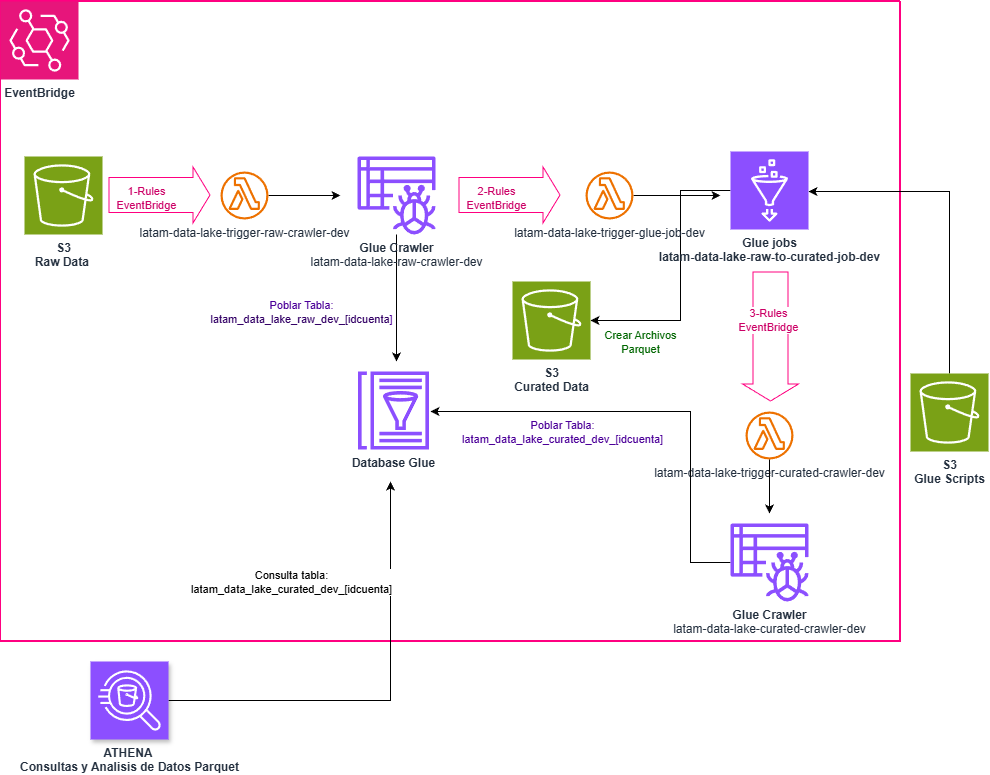

# Serverless AWS DataLake 

Sencillo laboratorio que construye un DataLake Serverless, creando un flujo automatizado de ingesta de datos con S3, EventBridge, Glue y consultas de los archivos parquet por medio de Athena.
El presente proyecto tiene por objetivo la preparación para la Certificacion AWS Data Engineer Associate y comprender como hacer el deploy en CloudFormation.

La presente versión esta inspirada en el github de: https://github.com/tuni56/serverless-aws-data-lake-with-kiro/

## Estructura del Proyecto

```
serverless-aws-datalake-1/
├── resources/                    # Imágenes y diagramas
│   ├── Athena.png
│   ├── AWS-Datalake1.png
│   ├── eventBridgeRules.png
│   └── gluejob.png
├── src/
│   └── glue_jobs/
│       └── raw_to_curated.py     # Script ETL de Glue
├── data-lake-infrastructure_cf.yaml  # Template CloudFormation
├── sales.csv                     # Datos de prueba
└── README.md                     # Documentación
```


## Costos del Laboratorio

**Costo estimado para desplegar y probar: ~$2-5 USD**

- **S3**: $0.023/GB (primeros 50TB) - ~$0.10 para datos de prueba
- **Glue Crawler**: $0.44/hora DPU - ~$0.50 por ejecuciones
- **Glue Job**: $0.44/hora DPU - ~$1.00 por transformaciones
- **Lambda**: Gratuito (dentro del tier gratuito)
- **EventBridge**: $1.00/millón de eventos - ~$0.01
- **Athena**: $5.00/TB escaneado - ~$0.01 para consultas de prueba
- **CloudWatch Logs**: $0.50/GB - ~$0.10

*Nota: Los costos pueden variar según la región y uso. ELIMINAR RECURSOS UNA VEZ CULMINADAS LAS PRUEBAS TAL CUAL SE INDICA EN LA SECCION lIMPIEZA!!.*


## Infraestructura y flujo de automatizacion del DataLake


Requisitos para la automatización (paso a paso en Deploy proxima sección)
1. Crear Bucket de S3 para scripts de Glue Job (S3 Glue Scripts)
2. Cargar el script de src/glue_jobs/raw_to_curated.py
3. Deploy de CloudFormation (data-lake-infrastructure_new.yaml)
4. Cargar datos de prueba en Raw Data (data/sample/sales.csv)

Flujo autimatica via EnventBridge(EB):
5. Se ejecuta la regla de EB que invoca una lambda y esta ultima ejecuta el ***Crawler de Glue***: latam-data-lake-trigger-raw-crawler-dev.
    -El crawler crea y puebla la tabla con el esquema del csv (latam_data_lake_raw_dev_[idcuenta]) 
6. Si su estado es ***Succeded***, se ejecuta la regla de EB que invoca una lambda y esta ultima ejecuta el ***Glue Job*** : latam-data-lake-raw-to-curated-job-dev.
    -LLena el bucket de ***Curated Data*** con archivos parquet.
7. Si su estado es ***Succeded***, se ejecuta la regla de EB que invoca una lambda y esta ultima ejecuta el ***Crawler de Glue***: latam-data-lake-trigger-cuarted-crawler-dev.
    -El crawler crea y puebla la tabla con los datos extraidos de los archivos parquet curados (latam_data_lake_curated_dev_[idcuenta])

Consulta de datos en Consola de AWS:
9. Via Amazon Athena, eligiendo la Base de datos latam-data-lake_dev_catalog y la tabla latam_data_lake_curated_dev_[idcuenta] --> Amazon Athena > Query editor

SELECT * FROM llatam_data_lake_curated_dev_[idcuenta];


## DEPLOY en AWS via CloudFormation
Antes de comenzar con los pasos, leer/revisar lo que vamos a ejecutar y enteneder el .yaml de cloudformation.

# 1. Crear el bucket donde se subira el script del glue job
```bash
aws s3 mb s3://latam-data-lake-glue-scripts-$(aws sts get-caller-identity --query Account --output text)
```

# 2. Subir el script
```bash
aws s3 cp src/glue_jobs/raw_to_curated.py s3://latam-data-lake-glue-scripts-$(aws sts get-caller-identity --query Account --output text)/scripts/
```

# 3. Deploy de CloudFormation completo

```bash
SCRIPTS_BUCKET=$(aws s3api list-buckets --query "Buckets[?starts_with(Name, 'latam-data-lake-glue-scripts-')].Name" --output text)

aws cloudformation deploy \
  --template-file data-lake-infrastructure_cf.yaml \
  --stack-name latam-data-lake-dev \
  --parameter-overrides GlueScriptsBucketName=$SCRIPTS_BUCKET \
  --capabilities CAPABILITY_NAMED_IAM
```

# 4. Subir los datos de Prueba sales.csv a Raw Data
Subiendo este archivo comienza el flujo automatico via rules de EventBridge.

```bash
aws s3 cp sales.csv s3://latam-data-lake-raw-dev-$(aws sts get-caller-identity --query Account --output text)
```

## 🧹 LIMPIEZA del ambiente --> IMPORTANTE ⭐

0. Eliminar el archivo subido a raw/curated data

```bash
aws s3 rm s3://latam-data-lake-raw-dev-$(aws sts get-caller-identity --query Account --output text)/sales.csv

aws s3 rm s3://latam-data-lake-curated-dev-$(aws sts get-caller-identity --query Account --output text) --recursive
```

1. Eliminar stack de CloudFormation

```bash
aws cloudformation delete-stack --stack-name latam-data-lake-dev
```

2. Eliminar Grupos de Logs (se deben eliminar ya haciendo delete en el stck de cloudformation no es suficiente)

```bash
LOG_GROUP_NAME_1="/aws-glue/crawlers"
LOG_GROUP_NAME_2="/aws-glue/jobs/error"
LOG_GROUP_NAME_3="/aws-glue/jobs/logs-v2"
LOG_GROUP_NAME_4="/aws/lambda/latam-data-lake-trigger-glue-job-dev"
LOG_GROUP_NAME_5="/aws/lambda/latam-data-lake-trigger-raw-crawler-dev"
LOG_GROUP_NAME_6="/aws-glue/jobs/output"
LOG_GROUP_NAME_7="/aws/lambda/latam-data-lake-trigger-curated-crawler-dev"

MSYS_NO_PATHCONV=1 aws logs delete-log-group \
    --log-group-name "$LOG_GROUP_NAME_1" \
    --region us-east-1
	
MSYS_NO_PATHCONV=1 aws logs delete-log-group \
    --log-group-name "$LOG_GROUP_NAME_2" \
    --region us-east-1

MSYS_NO_PATHCONV=1 aws logs delete-log-group \
    --log-group-name "$LOG_GROUP_NAME_3" \
    --region us-east-1

MSYS_NO_PATHCONV=1 aws logs delete-log-group \
    --log-group-name "$LOG_GROUP_NAME_3" \
    --region us-east-1

MSYS_NO_PATHCONV=1 aws logs delete-log-group \
    --log-group-name "$LOG_GROUP_NAME_4" \
    --region us-east-1

MSYS_NO_PATHCONV=1 aws logs delete-log-group \
    --log-group-name "$LOG_GROUP_NAME_5" \
    --region us-east-1

MSYS_NO_PATHCONV=1 aws logs delete-log-group \
    --log-group-name "$LOG_GROUP_NAME_6" \
    --region us-east-1

MSYS_NO_PATHCONV=1 aws logs delete-log-group \
    --log-group-name "$LOG_GROUP_NAME_7" \
    --region us-east-1
```

3. Eliminar bucket de scripts

```bash
# elimina todos los archivos dentro del bucket
aws s3 rm s3://latam-data-lake-glue-scripts-$(aws sts get-caller-identity --query Account --output text) --recursive
# elimina el bucket
aws s3api delete-bucket --bucket latam-data-lake-glue-scripts-$(aws sts get-caller-identity --query Account --output text)
```

## Utilidades de Logs y otros

1. EventBridge (flujo de eventos)

# Ver reglas activas
aws events list-rules --name-prefix latam-data-lake

# Ver invocaciones (después de subir el archivo)
aws events describe-rule --name latam-data-lake-s3-upload-to-raw-dev

2. Lambda Logs (CloudWatch)

# Raw Crawler Lambda
aws logs tail /aws/lambda/latam-data-lake-trigger-raw-crawler-dev --follow

# Glue Job Lambda
aws logs tail /aws/lambda/latam-data-lake-trigger-glue-job-dev --follow

# Curated Crawler Lambda
aws logs tail /aws/lambda/latam-data-lake-trigger-curated-crawler-dev --follow

3. Glue Crawlers

# Ver estado del raw crawler
aws glue get-crawler --name latam-data-lake-raw-crawler-dev

# Ver última ejecución
aws glue get-crawler-metrics --crawler-name-list latam-data-lake-raw-crawler-dev

4. Glue Job (ETL)

# Ver ejecuciones del job
aws glue get-job-runs --job-name latam-data-lake-raw-to-curated-job-dev --max-results 5

# Logs del job en CloudWatch
aws logs tail /aws-glue/jobs/output --follow

5. Visualmente en AWS Console

CloudWatch → Log Groups → Buscar latam-data-lake
Glue → ETL Jobs → Runs → Ver historial
EventBridge → Rules → Ver métricas de invocaciones

Ver imagenes en directorio resources

## Notas sobre la infraestructura desplegada:

**CloudFormation** automáticamente agrupa recursos con el mismo stack en una "aplicación" en Lambda.
Es una feature de AWS Lambda Applications que detecta funciones relacionadas por:

- Mismo stack de CloudFormation
- Mismo prefijo de nombre
- Tags comunes

Beneficio: Ver todas las funciones relacionadas juntas, métricas consolidadas y facilitar el monitoreo.

**EventBridge**
En este laboratorio se crearon rules sueltas en el bus por default que tiene el servicio.

**Circuito automatico**
Al subir un csv con el formato de sales.csv si lo volvemos a ejecutar no duplica la información (es idempotente)

**Job de Glue "latam-data-lake-raw-to-curated-job-dev"** en el codigo contiene eliminar los registros identicos. Podemos dar la logica que querramos para masajear los datos.

**Particiones**: Los archivos Parquet se particionan automáticamente por Spark según el número de workers/particiones que configures. En este caso se indico que se particionaba por el campo country. Y para el caso de los **workers** el job de glue se creo con esta configuracion por default:
Worker type: G.1X (4 vCPU, 16GB RAM)
Number of workers: 2

**Subir nuevos archivos csv**: cuando subimos un nuevo archivo sales las tablas NO se recrean, se actualizan.
Raw Crawler: Configurado con UpdateBehavior: UPDATE_IN_DATABASE - detecta cambios en el esquema y actualiza la tabla existente, agregando los nuevos datos
Curated Crawler: Misma configuración - actualiza la tabla existente con los nuevos archivos parquet.
Glue Job: El script raw_to_curated.py tiene dropDuplicates(), por lo que:
Si subes el mismo archivo: elimina duplicados, no duplica datos.
Si subes archivo diferente: agrega los nuevos registros únicos.


## 📄 Licencia

Este proyecto está bajo la Licencia MIT - ver el archivo [LICENSE](/LICENSE) para más detalles.

**⚠️ Nota Importante:** Este es un proyecto educativo para aprender a desplegar un sencillo DatLake Serverless en AWS. Revisar y ajustar lo necesario si estas pensando en utilizarlo a nivel productivo.