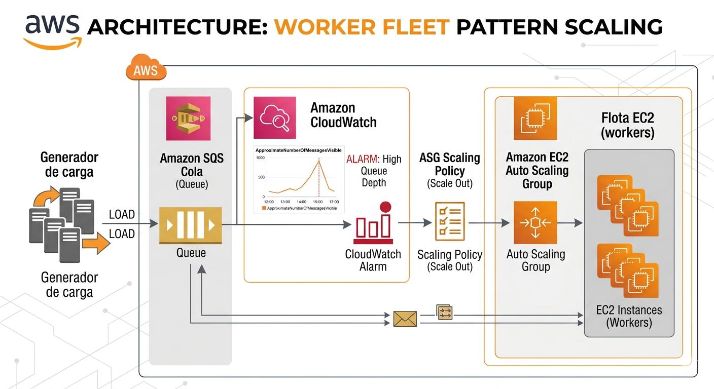
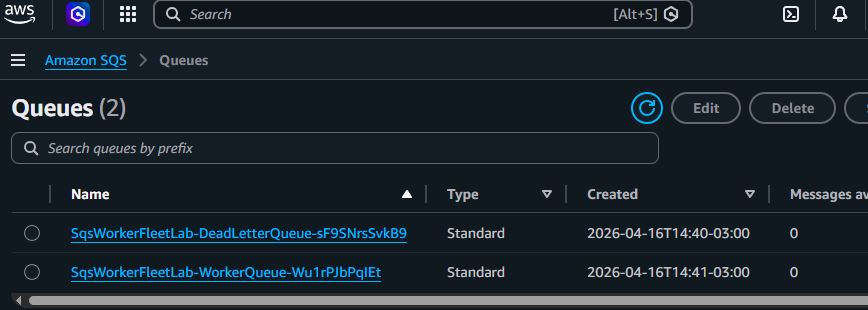
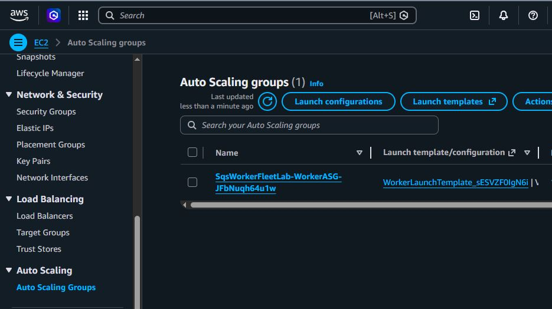
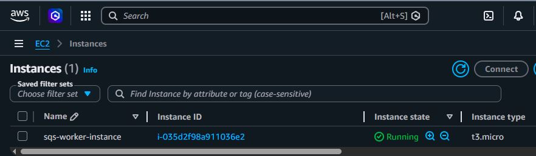
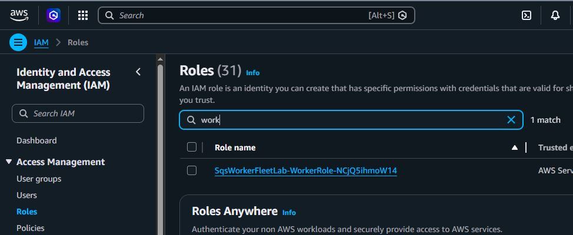
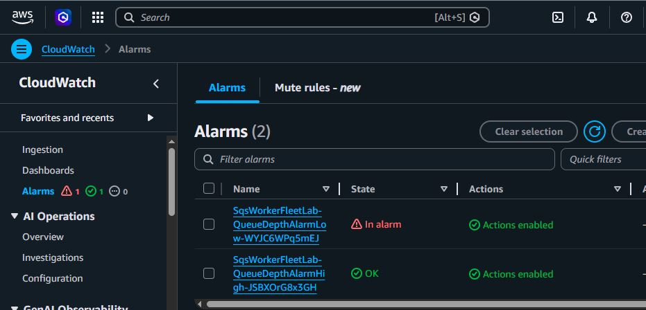

# Laboratorio Worker Fleet (SQS + ASG)

Este laboratorio tiene como fin aprender el patrón de arquitectura **Worker Fleet** en AWS, donde una flota de instancias EC2 consume mensajes de una cola SQS de forma autónoma, y el grupo de autoescalado ajusta dinámicamente la cantidad de instancias en función de la **profundidad de la queue.**

Al finalizar el laboratorio tendrás conocimientos en:

- Crear y configurar una cola SQS estándar.
- Desplegar un Auto Scaling Group (ASG) con una Launch Template.
- Configurar una alarma de CloudWatch que use la métrica `ApproximateNumberOfMessagesVisible`.
- Vincular la alarma a una Scaling Policy del ASG para escalar horizontalmente.
- Verificar el comportamiento del sistema enviando carga a la cola y observando el escalado.
- Validar el Health Check de las instancias EC2 dentro del ASG.

**Nota 1**: Este laboratorio puede formar parte del entrenamiento para los examenes de certificación AWS: SAA-C03 y CLF-C02.

**Nota 2**: Para mantener el laboratorio simple, rápido y evitar gastos o límites de cuotas de red, se utiliza un data block en Terraform (y lo equivalente en CloudFormation) que busca automáticamente tu VPC por defecto de la región junto con todas sus subredes, y despliega las instancias allí adentro (no se crea una nueva VPC)

---

## 🏛️ Arquitectura del laboratorio



---

## 📂 Estructura del Repositorio

```text
sqs-asg-ec2/
├── README.md                  ← Guía paso a paso principal
├── requerimientos.md          ← Este documento se utilizo para crear el lab
├── cloudformation/
│   └── template.yaml          ← Plantilla IaC nativa de AWS
├── terraform/                 ← Código IaC modular de HashiCorp
│   ├── asg.tf                 
│   ├── cloudwatch.tf          
│   ├── iam.tf                 
│   ├── outputs.tf             
│   ├── providers.tf           
│   ├── sqs.tf                 
│   └── variables.tf           
├── scripts/
│   ├── send_load.py           ← Generador de carga Python para testear la SQS
│   └── worker.py              ← Script referencial del código inyectado en EC2
└── resources/                 ← Assets y diagramas visuales
    ├── arq-workers.png
    ├── sqs-asg-fleet.jpg
    └── sqs-asg-fleet.xml
```

---

## 📋 Requisitos Previos

1. **Una cuenta de AWS** con permisos de administrador.
2. La **AWS CLI** [instalada y configurada](https://docs.aws.amazon.com/cli/latest/userguide/cli-configure-quickstart.html) con credenciales válidas en tu terminal.
3. Entorno **Bash** habilitado (Git Bash, Linux o macOS).
4. **Python 3** y la librería `boto3` instalados localmente para ejecutar el generador de carga:
   ```bash
   pip install boto3
   ```

---

## 💰 Costo Estimado

Al usar instancias `t3.micro` y asumiendo que eliminas todo al dar por terminada la sesión (1 a 2 horas de práctica), el costo estimado de este laboratorio es **menor a $0.10 USD**. Para las colas y las alarmas, los servicios de SQS y CloudWatch utilizados entran holgadamente dentro de la Capa Gratuita (Free Tier) de AWS.

---

## 🚀 Despliegue de Infraestructura (Podes hacerlo por CloudFormation o Terraform, recuerda limpiar el despliegue anterior antes de cambiar de método)

### CloudFormation

Desplegaremos todos los componentes de la arquitectura del laboratorio (Cola SQS, Worker Launch Template, Auto Scaling Group y Alarmas CloudWatch) utilizando la plantilla CloudFormation suministrada.

Ejecuta el siguiente bloque de comandos en tu terminal bash:

```bash
# Entra al directorio del laboratorio
cd sqs-asg-ec2

# Validar el template
aws cloudformation validate-template \
    --template-body file://cloudformation/template.yaml \
    --region us-east-1  
```

Desplegar el stack en aws, tarda unos minutos. Preparaté un 🧉
```bash
# Despliega el stack de CloudFormation 
aws cloudformation deploy \
  --template-file cloudformation/template.yaml \
  --stack-name SqsWorkerFleetLab \
  --capabilities CAPABILITY_IAM

# Obtén y exporta las variables del ambiente (IMPORTANTE PARA EJECUTAR LAS PRUEBAS, hazlo en cada terminal que abras para conservar los parametros en el ambiente)
export ASG_NAME=$(aws cloudformation describe-stacks --stack-name SqsWorkerFleetLab --query "Stacks[0].Outputs[?OutputKey=='AutoScalingGroupName'].OutputValue" --output text)
export QUEUE_URL=$(aws cloudformation describe-stacks --stack-name SqsWorkerFleetLab --query "Stacks[0].Outputs[?OutputKey=='QueueUrl'].OutputValue" --output text)

echo "Auto Scaling Group: $ASG_NAME"
echo "SQS Queue URL: $QUEUE_URL"
```


### Terraform
Antes de ejecutar los comandos de terraform, asegurate de tener las variables de aws configuradas en tu ambiente. Una buena practica es leer todos los archivos .tf para entender la infraestructura que se va a desplegar.
- providers.tf: La configuración base y etiquetado nativo.
- variables.tf: Entradas parametrizables (regiones e instancias).
- sqs.tf: La cola principal y la DLQ.
- iam.tf: El rol de instancia EC2, las políticas (SQS, Logging) y el Instance Profile.
- asg.tf: Data sources para la red (VPC default), el Security Group, Launch Template (con tu script inyectado en user data), el Auto Scaling Group y sus políticas (StepScaling).
- cloudwatch.tf: Las alarmas (Scale-Out y Scale-In) vinculadas a las políticas.
outputs.tf: Salidas idénticas a las de CloudFormation para poder automatizar mediante $QUEUE_URL y $ASG_NAME luego del despliegue.

```bash
# Entra al directorio del laboratorio
cd sqs-asg-ec2/terraform

# Inicializa terraform
terraform init

# Valida el template
terraform validate

# Planifica el despliegue (opcional)
terraform plan

# Despliega el stack de terraform
terraform apply -auto-approve

# Obtén y exporta las variables del ambiente (IMPORTANTE PARA EJECUTAR LAS PRUEBAS, hazlo en cada terminal que abras para conservar los parametros en el ambiente)
export ASG_NAME=$(terraform output -raw asg_name)
export QUEUE_URL=$(terraform output -raw queue_url)

echo "Auto Scaling Group: $ASG_NAME"
echo "SQS Queue URL: $QUEUE_URL"
```

### Controlar visualmente la infraestructura desplegada en consola de aws (OPCIONAL).

1. **SQS**



Un mensaje va a la Dead Letter Queue (DLQ) solo si falla al ser procesado varias veces, no por estar mucho tiempo esperando en la cola.
El despligue esta confifigurado para un maxReceiveCount: 3 y un Visibility Timeout. Funciona así:
-Un worker recibe el mensaje (Intento 1). Si el worker se cuelga o lanza un error y no borra el mensaje, este se vuelve visible nuevamente tras 30 segundos.
-Otro worker lo toma (Intento 2). También falla.
-Lo toma otro worker (Intento 3). También falla.
-Como ya alcanzó el máximo de 3 recepciones fallidas, SQS lo saca de la cola principal y lo mueve a la DLQ.

2. **Auto Scaling Group**



3. **Worker**



Podes revisar en **EC2/Launch Templates** el script que se inyecta en el user data y que permite que el worker se registre en el ASG.

4. **Rol IAM**



5. **CloudWatch Alarms**



La alarma disparada inmediatemente despues del despliegue es la QueueDepthAlarmLow. Esta alarma está configurada para entrar en estado In alarm cuando la cantidad de mensajes en la cola es menor o igual a 1 (<= 1).
La cola SQS está completamente vacía (0 mensajes), la condición se cumple inmediatamente. Esto es necesario porque le indica constantemente al Auto Scaling Group: "No hay trabajo, mantén las instancias al mínimo". Como el grupo ya está en su capacidad mínima (1), simplemente se queda en reposo sin hacer cambios.
La alarma verde (QueueDepthAlarmHigh) es la que vigila si hay tráfico alto (>= 10). Esta es la que se va poner roja en el simulacro del Paso 3 cuando inyectes carga.

Las alarmas de CloudWatch que se crearon para este laboratorio miran únicamente a la queue principal, y se disparan basados en la cantidad de mensajes "Visible" (mensajes en espera que aún no empezaron a ser procesados):
- La de Escalado (High): Se dispara cuando se acumulan 10 o más mensajes en la cola de forma sostenida durante 2 minutos. Esto indica que los workers actuales no dan basto y se necesita crear otra instancia EC2.
- La de Reducción (Low): Se dispara cuando la cola baja a 1 mensaje o ninguno de forma sostenida durante 3 minutos. Esto indica que no hay trabajo casi, por lo que ordena apagar instancias para ahorrar costos.


---

## 🧪 Pruebas y Uso del Sistema

Ten en cuenta que puede llevar un tiempo probar todo ya que se utilizan las instancias mas pequeñas y vamos a procesar 1000 mensajes.
### Paso 1: Validar el estado inicial

Inicialmente, el ASG debe contar con **exactamente 1 instancia** (`DesiredCapacity=1`). Para verificar su estado ejecuta:

```bash
aws autoscaling describe-auto-scaling-groups \
  --auto-scaling-group-names $ASG_NAME \
  --query 'AutoScalingGroups[0].Instances[*].{ID:InstanceId,Estado:HealthStatus}' --output table
```

### Paso 2: Monitoreo en Tiempo Real (Recomendado)

Abre **dos terminales de bash nuevas** para monitorear cómo el sistema autoescala. En las nuevas terminales, asegúrate de tener exportadas las variables `$ASG_NAME` y `$QUEUE_URL`. 

**Terminal 1 (Monitorear tráfico de SQS):**
```bash
while true; do clear; aws sqs get-queue-attributes --queue-url $QUEUE_URL --attribute-names ApproximateNumberOfMessages --query 'Attributes.ApproximateNumberOfMessages' --output text; sleep 5; done
```

**Terminal 2 (Monitorear flota en el Auto Scaling Group):**
```bash
while true; do clear; aws autoscaling describe-auto-scaling-groups --auto-scaling-group-names $ASG_NAME --query 'AutoScalingGroups[0].Instances[*].{ID:InstanceId,Estado:HealthStatus}' --output table; sleep 10; done
```
Para salir de cualquiera de las dos terminales presiona **Ctrl + C**.

### Paso 3: Generar picos de carga

Con todo listo, usar el script `send_load.py` para inyectar 1000 mensajes encolados a la SQS (si trabajas en linux puede que tengas que usar `python3` en lugar de `python`):

```bash
python scripts/send_load.py $QUEUE_URL 1000
```

### Paso 4: Observar el escalado (Scale-Out)

- Verás aumentar gradualmente los mensajes en la Terminal 1 (Cola SQS).
- Pasado un minuto o dos, la alarma de la profundidad de la cola sobrepasará el límite (límite `>= 10` activará la alarma _High_).
- Entonces el Auto Scaling Group irá sumando otra instancia. (Verás aparecer un nuevo ID de Instancia en la Terminal 2). Esto sigue ocurriendo progresivamente mientras sigan habiendo más de 10 mensajes (con un techo de max=4 instancias).

### Paso 5: Retorno a la normalidad (Scale-In)

- Eventualmente (ya sin carga nueva), las instancias consumirán el total de los mensajes y la metrica en la *Terminal 1* volverá a `0`.
- Una vez finalizado el tráfico sostenido por un lapso estimado de 3 minutos, CloudWatch activa el umbral bajista de la Alarma.
- El ASG comenzará a terminar instancias extra, logrando retornar al cupo configurado en `MinCapacity=1`.

### Paso 6: Error manual y Health Check (Prueba de Resilencia)

Este paso simula una recesión en uno de los nodos o un kernel panic EC2 de los workers:

```bash
# 1. Obtener el ID de uno de los instances corriendo
INSTANCE_ID=$(aws autoscaling describe-auto-scaling-groups --auto-scaling-group-names $ASG_NAME --query 'AutoScalingGroups[0].Instances[0].InstanceId' --output text)

# 2. Reemplazar el status a Inservible de forma manual: 
aws autoscaling set-instance-health \
  --instance-id $INSTANCE_ID \
  --health-status Unhealthy

# 3. Observar durante un minuto extra para ver como reacciona el ASG:
while true; do clear; aws autoscaling describe-auto-scaling-groups --auto-scaling-group-names $ASG_NAME --query 'AutoScalingGroups[0].Instances[*].{ID:InstanceId,Estado:HealthStatus,Lifecycle:LifecycleState}' --output table; sleep 10; done
```  

Vas a notar cómo AWS Auto Scaling Group finaliza el worker averiado y paralelamente enciende otro recurso sano.

---

## 🧹 Limpiar Entorno de Práctica 

Para no tener sorpresas en la factura eliminá el stack de CloudFormation una vez que terminaste el laboratorio. No saltees este paso:

### Limpieza CloudFormation
```bash
aws cloudformation delete-stack --stack-name SqsWorkerFleetLab
```
Espera unos minutos y verificar en la consola que el stack ha sido completamente terminado.

### Limpieza Terraform

```bash
cd sqs-asg-ec2/terraform
terraform destroy -auto-approve
```
Espera unos minutos y verificar en la consola que el stack ha sido completamente terminado. 

## 🎯 Posibles casos de Uso reales:

- **Procesamiento de medios**: Cuando subís un video a YouTube o una foto a Instagram, un mensaje entra a una cola y una flota de workers lo transcodifica, redimensiona o aplica filtros en paralelo. El volumen es impredecible, por eso necesita escalar.
- **E-commerce y pagos**: En un Black Friday, los pedidos no se procesan sincrónicamente. Van a una cola y una flota los procesa: validación de stock, cobro, generación de factura, notificación. Si el volumen explota, el ASG lanza más workers.
- **Envío masivo de emails/notificaciones**: Plataformas como Mailchimp o cualquier sistema de marketing que manda millones de emails en batch. Cada mensaje en la cola representa un email a enviar. Los workers consumen y envían sin saturar el servicio de correo.
- **ETL y procesamiento de datos**: Pipelines de datos donde cada mensaje representa un archivo a procesar, transformar y cargar en un data warehouse. Muy común en fintech para procesar transacciones o conciliaciones bancarias al cierre del día.
- **Indexación de búsqueda**: Cuando actualizás un producto en un ecommerce, un mensaje va a la cola y un worker actualiza el índice de Elasticsearch o OpenSearch. Desacopla la escritura en base de datos del proceso de indexación.
- **Procesamiento de imágenes médicas o satelitales**: Análisis de radiografías, tomografías o imágenes de satélite donde cada imagen es un mensaje. El procesamiento es costoso en CPU y completamente paralelizable.
- **Web scraping / crawling a escala**: Cada URL a scrapear es un mensaje. Los workers consumen, hacen el request, parsean y guardan. Si la cola crece (muchas URLs nuevas), el ASG escala.

## 📄 Licencia

Este proyecto está bajo la Licencia MIT.