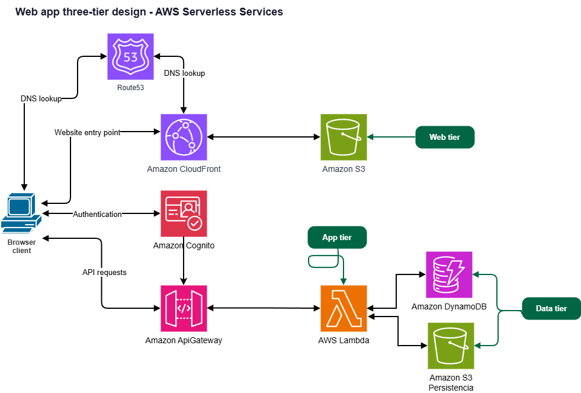

# Arquitectura: Web App Serverless - Mariposas Bonaerenses Nativas

## Visión General

Aplicación web serverless educativa sobre mariposas nativas de la provincia de Buenos Aires.
Permite a cualquier visitante explorar el catálogo de especies, y a los usuarios registrados
contribuir con sus propios avistamientos (foto + metadata).

El diseño sigue el modelo de **3 capas serverless en AWS** (Web Tier → App Tier → Data Tier)



---

## Servicios AWS Involucrados

| Capa | Servicio | Rol |
| :--- | :--- | :--- |
| **Web Tier** | Amazon S3 | Hosting del frontend estático (React/Vite build) |
| **Web Tier** | Amazon CloudFront | CDN - punto de entrada, HTTPS, caché global |
| **Web Tier** | Amazon Route 53 | DNS opcional (dominio custom) |
| **App Tier** | Amazon Cognito | Autenticación y gestión de usuarios |
| **App Tier** | Amazon API Gateway | REST API - punto de entrada de todas las operaciones |
| **App Tier** | AWS Lambda | Lógica de negocio (CRUD de mariposas) |
| **App Tier** | Amazon S3 (imágenes) | Almacenamiento de fotos subidas por usuarios |
| **Data Tier** | Amazon DynamoDB | Persistencia de metadata de mariposas |

---

## Flujo Principal por Caso de Uso

### Caso 1: Visitante anónimo (sin login)

```
Browser → CloudFront → S3 (frontend)
         └── Carga la SPA (React)
         └── Muestra catálogo estático (mariposasPrecargadas en data/)
         └── NO puede acceder a la galería de fotos de usuarios
         └── NO puede acceder a la sección "Subir Mariposa"
```

Las mariposas precargadas viven en el frontend (`src/data/mariposas.ts`) y se sirven
como contenido estático desde S3/CloudFront sin necesitar autenticación ni API.

---

### Caso 2: Login de usuario

```
Browser → CloudFront → S3 (frontend SPA)
         └── El usuario hace clic en "Iniciar Sesión"
         └── Frontend llama a Cognito (AWS Amplify SDK o Cognito Hosted UI)
         └── Cognito valida credenciales y devuelve JWT tokens (ID Token, Access Token)
         └── Frontend almacena los tokens en memoria (o sessionStorage)
         └── Navbar y rutas se actualizan para mostrar secciones protegidas
```

> **Nota sobre el frontend actual:** El `AuthContext.tsx` ya tiene el esqueleto correcto
> (`login`, `logout`, `isAuthenticated`, `user`). Hoy simula el login localmente.
> La integración real reemplaza la simulación por llamadas al SDK de Cognito (Amplify Auth).

---

### Caso 3: Usuario logueado ve galería de avistamientos de otros usuarios

```
Browser (con JWT) → CloudFront → API Gateway
                                └── Authorizer: Cognito JWT Authorizer (valida token)
                                └── GET /mariposas
                                    └── Lambda: GetMariposas
                                        └── DynamoDB: Scan/Query tabla "Mariposas"
                                            └── Retorna lista de items con metadata
                                                └── Las imagenUrl apuntan a S3 (imágenes)
                                                    └── Frontend renderiza GallerySection
                                                        con userMariposas del API
```

La `GallerySection` ya recibe `userMariposas` como prop desde `App.tsx`.
Hoy las combina con `mariposasPrecargadas`. En producción, `userMariposas`
viene del llamado al API autenticado.

---

### Caso 4: Usuario logueado sube una mariposa (foto + metadata)

Este es el flujo más complejo. Tiene **dos pasos** para evitar pasar la imagen
por Lambda (buena práctica AWS):

```
┌─────────────────────────────────────────────────────────────────────┐
│  PASO A - Obtener URL prefirmada para subir la imagen directamente  │
│                                                                     │
│  Browser → API Gateway (con JWT)                                    │
│            └── POST /mariposas/upload-url                           │
│                └── Lambda: GeneratePresignedUrl                     │
│                    └── Genera S3 Presigned URL (PUT, válida ~5 min) │
│                    └── Devuelve: { uploadUrl, imagenKey }           │
└─────────────────────────────────────────────────────────────────────┘

┌─────────────────────────────────────────────────────────────────────┐
│  PASO B - Frontend sube la imagen directo a S3 con la URL prefirmada│
│                                                                     │
│  Browser → S3 Bucket (imágenes) via PUT request con URL prefirmada  │
│            └── La imagen queda en: s3://bucket-imagenes/{userId}/{key}│
└─────────────────────────────────────────────────────────────────────┘

┌─────────────────────────────────────────────────────────────────────┐
│  PASO C - Guardar metadata en DynamoDB                              │
│                                                                     │
│  Browser → API Gateway (con JWT)                                    │
│            └── POST /mariposas                                      │
│                └── Lambda: CreateMariposa                           │
│                    └── DynamoDB PutItem: tabla "Mariposas"          │
│                        └── Item: { id, nombreComun,                 │
│                                     nombreCientifico, descripcion,  │
│                                     plantaNutricia, ecorregion,     │
│                                     imagenKey, usuarioId,           │
│                                     fechaSubida }                   │
└─────────────────────────────────────────────────────────────────────┘
```

> **¿Por qué no pasar la imagen por Lambda?**
> Lambda tiene límite de 6MB en payload. Las fotos pueden ser más grandes.
> La URL prefirmada (S3 Presigned URL) permite que el browser suba directamente
> a S3 de forma segura y eficiente, sin pasar por el backend.

---

## Modelo de Datos DynamoDB

### Tabla: `Mariposas`

| Atributo | Tipo | Descripción |
| :--- | :--- | :--- |
| `id` | String (PK) | UUID generado por Lambda |
| `usuarioId` | String (SK) | ID del usuario que subió (del JWT) |
| `nombreComun` | String | Nombre común de la mariposa |
| `nombreCientifico` | String | Nombre científico |
| `descripcion` | String | Descripción del avistamiento |
| `plantaNutricia` | Map | `{ nombreCientifico, nombreComun }` |
| `ecorregion` | String | `pampeana` / `espinal` / `delta` |
| `imagenKey` | String | Key del objeto en S3 (no la URL pública) |
| `fechaSubida` | String | ISO 8601 timestamp |

> **imagenKey vs imagenUrl:** Se guarda solo el `key` de S3 (ej: `uploads/user-123/abc.jpg`).
> La URL pública se construye dinámicamente en el frontend o la genera Lambda al retornar los datos.
> Esto permite cambiar la URL base o el bucket sin migrar datos.

### Índices Secundarios (GSI recomendados)

| GSI | PK | SK | Uso |
| :--- | :--- | :--- | :--- |
| `GSI-ecorregion` | `ecorregion` | `fechaSubida` | Filtrar galería por ecorregión |
| `GSI-usuario` | `usuarioId` | `fechaSubida` | Ver avistamientos de un usuario |

---

## Estructura de Buckets S3

```
s3://mariposas-frontend-{env}/          ← Hosting frontend (público vía CloudFront)
    index.html
    assets/
    ...

s3://mariposas-imagenes-{env}/          ← Fotos de usuarios (privado, acceso vía URL prefirmada)
    uploads/
        {usuarioId}/
            {uuid}.jpg
```

> El bucket de imágenes **NO es público**. CloudFront con OAC (Origin Access Control)
> puede servir las imágenes sin exponerlas directamente.

---

## Endpoints API Gateway (REST)

| Método | Path | Auth | Lambda | Descripción |
| :--- | :--- | :--- | :--- | :--- |
| `GET` | `/mariposas` | Cognito JWT | `GetMariposas` | Listar avistamientos de usuarios |
| `POST` | `/mariposas` | Cognito JWT | `CreateMariposa` | Guardar metadata en DynamoDB |
| `POST` | `/mariposas/upload-url` | Cognito JWT | `GeneratePresignedUrl` | Generar URL prefirmada para subida a S3 |
| `DELETE` | `/mariposas/{id}` | Cognito JWT | `DeleteMariposa` | Eliminar propio avistamiento |

---

## Integración con el Frontend Existente

| Componente Frontend | Integración AWS |
| :--- | :--- |
| `AuthContext.tsx` - función `login()` | → Reemplazar simulación por `Auth.signIn()` de AWS Amplify o Cognito SDK |
| `GallerySection.tsx` - prop `userMariposas` | → Populate desde `GET /mariposas` (solo si `isAuthenticated`) |
| `UploadSection.tsx` - `handleSubmit` | → Ejecutar flujo de 3 pasos (Presigned URL → PUT S3 → POST /mariposas) |
| `useMariposas` hook | → Encapsular las llamadas al API con el JWT del AuthContext |
| Tipo `Mariposa` en `types/mariposas.ts` | → Agregar campo `imagenKey` para producción, mantener `imagen` como URL construida |

---

## Seguridad

- **Cognito User Pool:** Gestión de usuarios y emisión de JWT.
- **API Gateway JWT Authorizer:** Valida el `Authorization: Bearer <token>` en cada request protegido.
- **S3 Presigned URL:** Permiso temporal (TTL corto) para PUT. El Key incluye el `userId` del token para evitar escritura en paths ajenos.
- **Lambda:** Verifica `usuarioId` del JWT al crear/eliminar items. Un usuario solo puede eliminar sus propios avistamientos.
- **CORS:** Configurado en API Gateway para permitir solo el dominio de CloudFront.
- **Bucket imágenes privado:** No hay acceso público directo. CloudFront + OAC controla el acceso.

---

## Deployment: Infraestructura como Código

El repositorio deberá ofrecer **dos opciones de despliegue** siguiendo el patrón del resto de laboratorios:

```
/
├── cloudformation/
│   ├── template.yaml          ← Stack completo (Cognito, S3, CloudFront, API GW, Lambda, DynamoDB)
│   ├── deploy.ps1             ← Script de despliegue
│   └── delete-cloudformation.ps1
│
├── terraform/
│   ├── main.tf
│   ├── variables.tf
│   └── outputs.tf
│
├── src/
│   ├── lambda_get_mariposas.py
│   ├── lambda_create_mariposa.py
│   ├── lambda_delete_mariposa.py
│   └── lambda_generate_presigned_url.py
│
└── frontend/
    └── app/                   ← Proyecto React/Vite existente
```

### Recursos IaC a definir

1. **S3 Bucket** - Frontend (con política de acceso vía CloudFront OAC)
2. **S3 Bucket** - Imágenes de usuarios (privado, CORS habilitado para PUT prefirmado)
3. **CloudFront Distribution** - CDN frontal con OAC para ambos buckets
4. **Cognito User Pool** + **User Pool Client** - Autenticación
5. **DynamoDB Table** - `Mariposas` con GSIs
6. **IAM Role** - Para Lambdas (permisos a DynamoDB + S3)
7. **Lambda Functions** - 4 funciones (Get, Create, Delete, PresignedUrl)
8. **API Gateway REST API** - Con Cognito Authorizer y rutas definidas

---

## Diagrama de Referencia

Ver: `WebApp_Arq_3 capas.PNG`

```
DNS lookup ──► Route 53
                  │
                  ▼
Browser ◄──── CloudFront ◄── S3 (Frontend)        [Web Tier]
   │
   │ Autenticación
   ▼
Amazon Cognito                                      [App Tier]
   │
   │ API requests (JWT)
   ▼
API Gateway ──► Lambda ──► DynamoDB                [Data Tier]
                    │
                    └──► S3 (Imágenes, vía Presigned URL generada por Lambda)
```
